<!-- Page 1 -->
 
 
 
2025 ICF CANOE POLO 
RULE CLARIFICATIONS 
WWW.CANOEICF.COM/RULES 
 
 
 
 
 
 
 
ICF Canoe Polo 

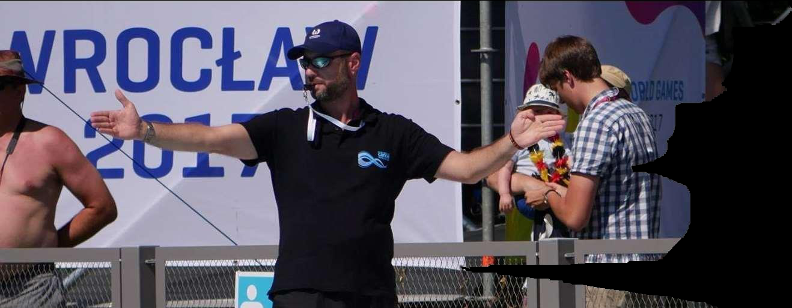
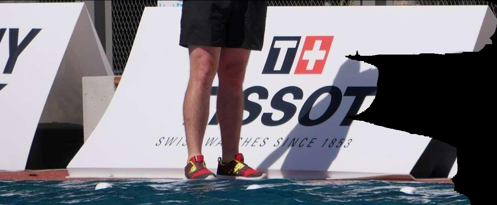

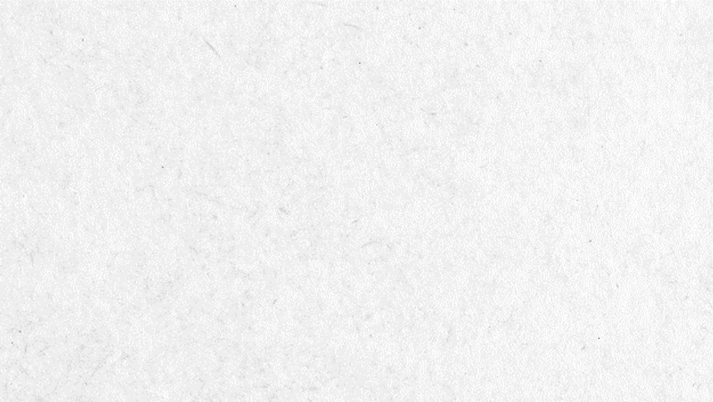
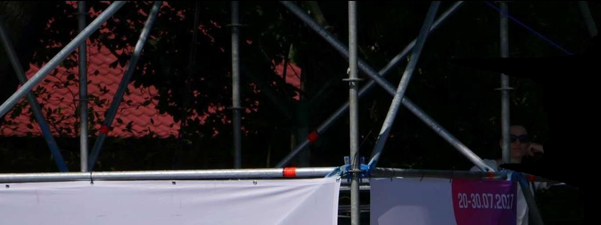
<!-- Page 2 -->
 
Contents 
 
1.Sprint starts 
2.Defender's paddle 
3. Illegal hand tackle 
 
 
 
 
          ICF Canoe Polo 

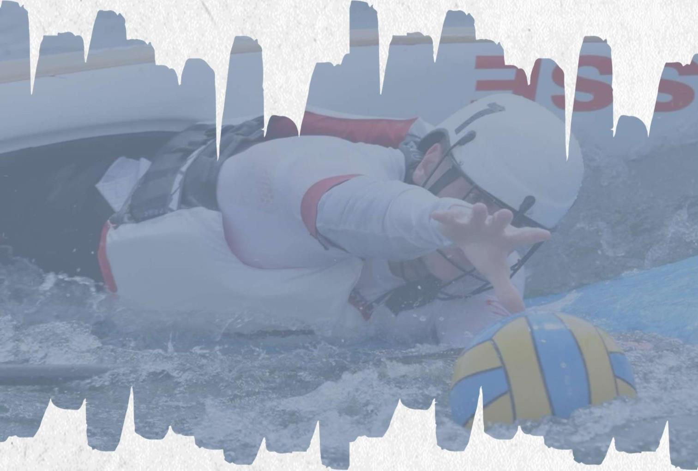
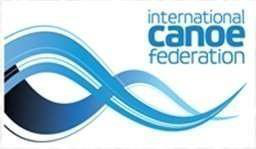

<!-- Page 3 -->
SPRINT STARTS (1) 
 
Not at the Same Time: 
If one player arrives late and fails to maintain control of their kayak, resulting 
in direct contact with the nose of their kayak on the opponent’s body, PFD, 
or helmet, the action will be considered deliberate and/or dangerous. 
 
• 
The referee shall call an Illegal Kayak Tackle, 
 
• 
A sanction card will be awarded, 
 
• 
The color of the card will be determined based on the severity and 
impact of the contact. 
 
If a player chooses to dive in front of an opponent’s kayak to gain 
possession of the ball, and as a result is hit by the opponent' s kayak, this 
will not be considered as a dangerous tackle by the opponent because they 
did not cause the dangerous kayak tackle. 
 
If one player is clearly first to the ball, the other player (who does not get 
the ball) must make the effort to avoid any dangerous kayak tackle or 
contact with the opponent's body. 
ICF Canoe Polo 
3 

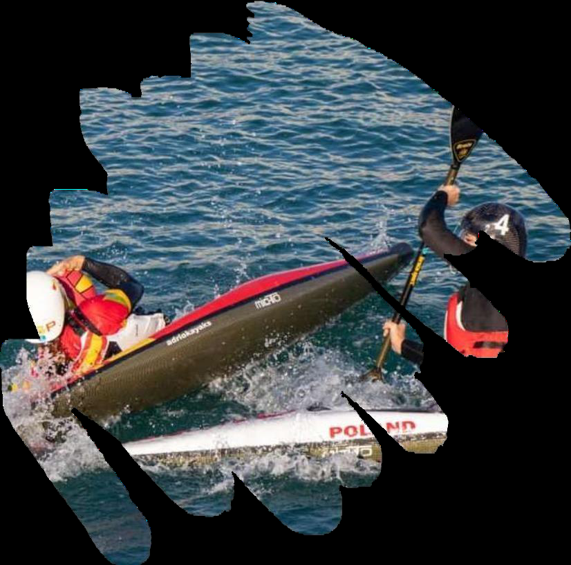

<!-- Page 4 -->
SPRINT STARTS (2) 
 
 
Both arrive at the Same Time: 
If both players arrive at exactly the same time 
and there is incidental contact, such as one 
kayak sliding over the other without significant 
impact, it will be considered normal play. 
• 
No foul will be called, 
• 
No card will be issued, as the contact is 
not deliberate, as both players are 
contesting the ball fairly. 
 
 
 
 
 
 
ICF Canoe Polo 
4 

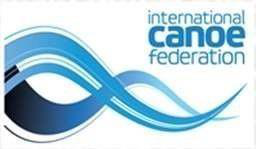
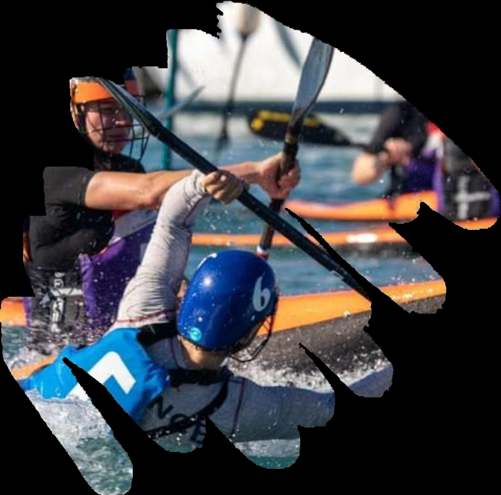
<!-- Page 5 -->
DEFENDER’S PADDLE 
 
If a defender is stationary with their hand(s) or paddle 
positioned beyond arm’s reach, and an 
attacker 
deliberately initiates contact by moving into that area: 
• 
No foul will be called, provided that, 
 
• 
The defender’s hand(s) or paddle remain stationary, 
• 
It is the attacker’s responsibility to avoid contact in 
such situations when attempting to shoot or score a goal. 
 
 
 
 
ICF Canoe Polo 
5 

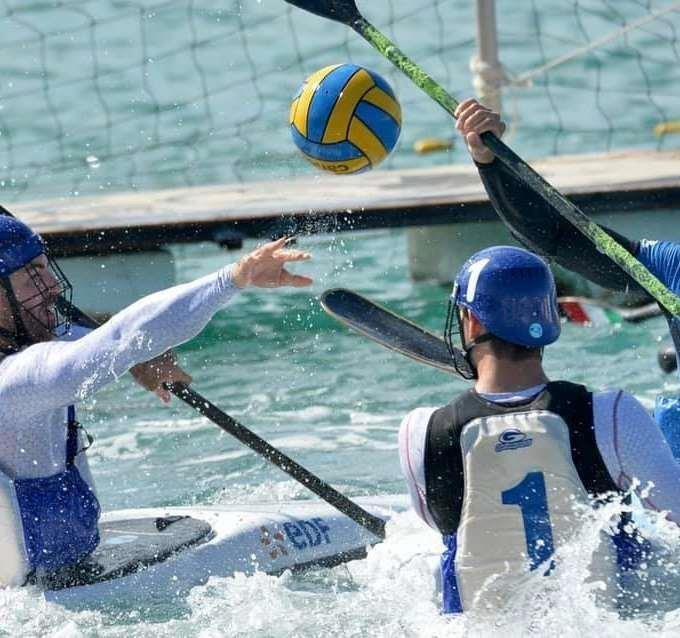

<!-- Page 6 -->
 
 
ILLEGAL HAND TACKLE (1) 
 
 
 
Before the Throwing Action begins: 
If the attacker’s arm is stationary and the throwing action has not 
yet started, 
The defender may play the ball, provided that: 
• 
There is no forceful or downward action, 
• 
The contact is not dangerous, and 
• 
The defender makes contact only with the ball, not the hand or 
arm. 
ICF Canoe Polo 
6 

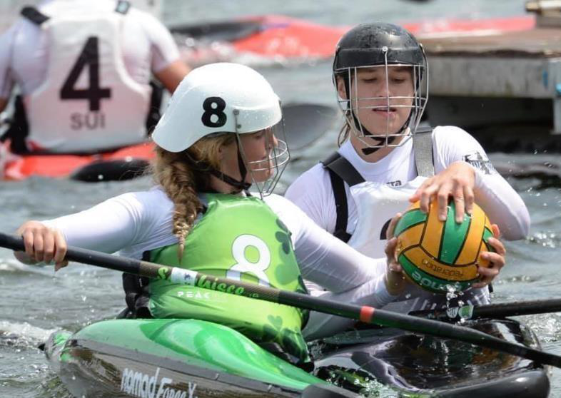
<!-- Page 7 -->
ILLEGAL HAND TACKLE (2) 
 
 
 
 
Once the Throwing Action begins: 
As soon as the ball is raised behind the attacker’s head, 
indicating the start of the throwing motion: 
• 
No contact is permitted with the attacker’s 
throwing arm or the ball. 
10.21.2.d - Any hand-tackle from the side or from 
behind, that either strikes or pulls back the throwing 
arm of a player who is in the process of throwing or 
passing the ball. 
 
 
 
ICF Canoe Polo 
7 

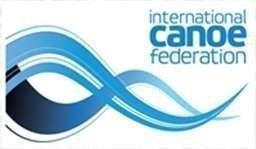
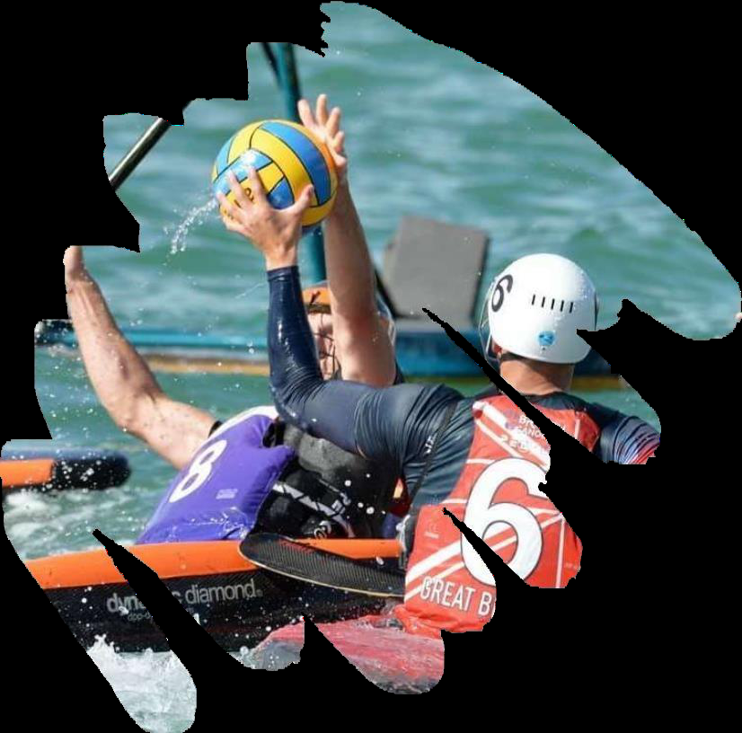