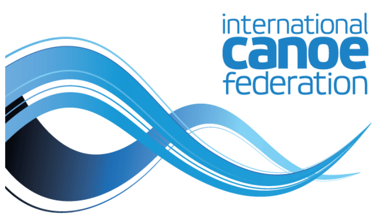

INTERNATIONAL CANOE FEDERATION 

## **CANOE POLO** 

## COMPETITION RULES 

## **2025** 

## Taking effect from 1 January 2025 

## **INTRODUCTION** 

The purpose of this document is to provide the rules that govern: 

- a) Canoe Polo 

- b) The organisation of Canoe Polo competitions 

## **LANGUAGE** 

In case of doubt, British English written language is the recognised language for all communication relating to these competition rules and the conduct of all canoeing international competitions. 

Any word which may imply the masculine gender also includes the feminine. 

## **COPYRIGHT** 

Copyright belongs to the ICF. 

These rules may be photocopied. 

The original version of this rule book can be found on the ICF website www.canoeicf.com. 

## **RULES STRUCTURE** 

|**STRUCTURE**||
|---|---|
|**ICF Sport Governance Rules** • Common Rules applicable to all disciplines • Exactly the same wording contained in the first chapter of each rule book|[CR]|
|**ICF Principle Rules** • The principle is applicable to all disciplines • Rules tailor made for each discipline • The principle affects all NFs to a high extent|[PR]|
|**ICF Sport Rules** • Competition and Field of Play rules • All technical aspects specific to the disciplines|[SR]|

## **RULES DECISION PROCESS** 

## **ICF Sport Governance Rules [CR]** 

||Congress|Board of Directors|Technical Committee|National Federations|
|---|---|---|---|---|
|Proposal||X|X|X|
|Drafting Wording||X|||
|Discussion|X||||
|Vote|X||||

## **ICF Principle Rules [PR]** 

||Congress|Board of Directors|Technical Committee|National Federations|
|---|---|---|---|---|
|Proposal||X|X|X|
|Drafting Wording||X|||
|Discussion|X||||
|Vote|X Overall policy and direction|X Final wording after congress|||

## **ICF Sport Rules [SR]** 

||Congress|Board of Directors|Technical Committee|National Federations|
|---|---|---|---|---|
|Proposal|||X|X|
|Drafting Wording|||X||
|Discussion||X|||
|Vote||X|||

## **PROCEDURE FOR REVIEW OF ICF RULES** 

|The**year prior to**the Congress|**_May to November_**|Consultation with all stakeholders (e.g. athletes, coaches, officials) about rule changes needed.|
|---|---|---|
||**_December to 1st March_**|Rule proposals by National Federations and ICF Technical Committees.|
|The year of the Congress|||
||**_March_**|Analysis of all proposals by ICF Technical Committees.|
||First ICF Board of Directors meeting **_in March / April_**|Vote of the sport rules [SR]. Assessment of sport governance rules [CR] and principle rules [PR].|
||At least three**(3) months** **prior to**the Congress|Publication of the approved sport rules [SR] by the ICF Board of Directors. Publication of the assessed sport governance rules [CR] and principle rules [PR].|
||ICF Congress **_November / December_**|Vote of the sport governance rules [CR]. Vote of the main policies and directions concerning the principle rules [PR].|
||Board of Directors meeting after the Congress **_November / December_**|Vote of the principle rules [PR].|
||**1st January** After the Congress|Publication and application of the approved rule changes.|

## GLOSSARY 

||GLOSSARY|
|---|---|
|**Sport**|The sport is canoeing, kayaking and all paddling activities.|
|**National** **Federation**|Member National Federation of the International Canoe Federation.|
|**Discipline**|A discipline is a branch of a sport comprising one (1) or several events (e.g. Canoe Sprint, Canoe Slalom…).|
|**Competition**|The competition runs from the start of the first event to the completion of the last event of a discipline, excluding the Opening and Closing Ceremonies.|
|**Athlete or** **player**|Male or female athlete In Canoe Polo refer to player|
|**Gender**|Men or Women|
|**Boat**|A boat is the watercraft used to practice canoeing (e.g. canoe, kayak, SUP): • A single boat: a boat with only one (1) place for an athlete (e.g. kayak single); • A crew boat: a boat with more than one (1) place for an athlete (e.g. canoe four).|
|**Age group**|e.g. junior, under 21, under 23, masters depending on each discipline|
|**Category**|A category is defined by a boat and a gender (e.g. Men Kayak, Mixed Canoe).|
|**Class**|A class is defined by a category and the number of places in a boat (e.g. men kayak double; women canoe four).|
|**Event**|An event is a contest in one (1) discipline resulting in the award of medals. An event is defined by at least a class and depending on the competition and the discipline with the additional optional information: a distance and / or an age group (e.g. junior men’s kayak double 500m, under 23 women’s kayak single, men’s canoe double classic).|

|**Type of event**|• **Individual events:**A boat comprised of one (1) or more athletes competing against other boats. • **Team events:**two (2) or more boats competing together against other teams.|
|---|---|
|**Event Phase**|A stage of competition (e.g. preliminaries, heats, semi-final, final).|
|**Groups**|Denoting one section (usually 5-10 athletes) that paddle in reverse ranked sequence for each run in a phase.|
|**Run or race or** **match**|The basic unit of an event phase (e.g. heats 1strun, semi-final, final).|
|**Competition** **programme**|The list of events included in a competition.|
|**Competition** **schedule**|The complete list of events and their different phases with the time at which they will be held.|
|**International** **Technical** **Official**|Oversee the operation of the competition.|
|**Host** **Organising** **Committee**|The host organising committee can be a National Federation or a subsidiary or a third-party organisation specialising in competition management.|
|**Definition of** **meaning**|• may: optional • should: recommendation • must: mandatory / compulsory|

## LIST OF ABBREVIATIONS 

|**ICF**|International Canoe Federation|
|---|---|
|**ITO**|International Technical Official|
|**HOC**|Host Organising Committee|
|**CAP**|Canoe Polo|

## TABLE OF CONTENTS 

**CHAPTER 1 - SPORT GOVERNANCE ................................................................... 15** 1.1 - International competitions .................................................... [CR] ......................................... 15 1.2 - International competition calendar ........................................ [CR] ......................................... 15 1.3 - Athlete eligibility for ICF competition (level 1 to 3)  ............... [CR] ......................................... 16 1.4 - Age group ............................................................................. [CR] ......................................... 17 1.5 - Athlete sporting nationality change ....................................... [CR] ......................................... 17 1.6 - Entries process ..................................................................... [CR] ......................................... 18 1.7 - Validity of a competition ....................................................... [CR] ......................................... 20 1.8 - ICF World Championships (level 1) ......................................... [CR] ......................................... 20 1.9 - Masters World Championships (level 4) ................................... [CR] ......................................... 22 1.10 - Anti-doping ......................................................................... [CR] ......................................... 22 1.11 - Appeal to the ICF Board of Directors .................................... [CR] ......................................... 22 1.12 - Disqualification for serious unsportsmanlike behaviour .......... [CR] ......................................... 23 1.13 - Results ............................................................................... [CR] ......................................... 23 1.14 - Trademarks and advertising ................................................. [CR] ......................................... 23 1.15 - International Technical Official (ITO) – examination .............. [CR] ......................................... 24 1.16 - ITO – nomination for ICF competitions .................................. [CR] ......................................... 25 **CHAPTER 2 - INTRODUCTION ........................................................................... 26** 2.1 - Objective ............................................................................. [PR] ......................................... 26 2.2 - International competitions .................................................... [PR] ......................................... 26 2.3 - Participating delegations ........................................................ [SR] ......................................... 26 2.4 - Host organising committee ..................................................... [SR] ......................................... 27 2.5 - Duties of the HOC .................................................................. [SR] ......................................... 27 **CHAPTER 3 - PLAYER EQUIPMENT .................................................................... 30** _**I - EQUIPMENT ..................................................................................................... 30**_ 3.1 - Kayaks ................................................................................. [PR] ......................................... 30 3.2 - Paddles ................................................................................. [SR] ......................................... 30 3.3 - Personal equipment ............................................................... [SR] ......................................... 30 3.4 - Exchanging equipment ........................................................... [SR] ......................................... 31 3.5 - Scrutineering ........................................................................ [SR] ......................................... 31 _**II - IDENTIFICATIONS ............................................................................................... 32**_ 3.6 - Identification ........................................................................ [SR] ......................................... 32 **CHAPTER 4 - COMPETITION PROGRAMME ............................................................ 33** 4.1 - Events .................................................................................. [PR] ......................................... 33 **CHAPTER 5 - COMPETITION FORMAT ................................................................. 34** 5.1 - Competition systems .............................................................. [SR] ......................................... 34 5.2 - Preliminary round .................................................................. [SR] ......................................... 34 5.3 - Intermediate round ................................................................ [SR] ......................................... 35 5.4 - Final round ............................................................................ [SR] ......................................... 35 5.5 - Procedure for deciding League points and positions ................. [SR] ......................................... 35 5.6 - Advancement to later rounds ................................................. [SR] ......................................... 36 5.7 - Tie breaking .......................................................................... [SR] ......................................... 36 

**CHAPTER 6 - INVITATIONS AND ENTRIES ............................................................ 37** 6.1 - Form of communication ......................................................... [SR] ......................................... 37 6.2 - Invitations ............................................................................ [PR] ......................................... 37 6.3 - Entries policies ..................................................................... [PR] ......................................... 38 6.4 - Entries process ..................................................................... [PR] ......................................... 38 6.5 - Determination of events ......................................................... [SR] ......................................... 40 6.6 - Selection of entries ................................................................ [SR] ......................................... 40 6.7 - Advice of acceptance ............................................................. [SR] ......................................... 40 6.8 - Coaches and anti-doping rules ................................................ [SR] ......................................... 40 **CHAPTER 7 - COMPETITION OFFICIALS ............................................................... 41** _**I - THE OFFICIALS .................................................................................................. 41**_ 7.1 - Competition Committee ........................................................ [PR] ......................................... 41 7.2 - Competition Committee – duties ............................................. [SR] ......................................... 41 7.3 - Officials - definition ............................................................... [SR] ......................................... 42 7.4 - Officials – Appointment .......................................................... [SR] ......................................... 43 7.5 - Chief Official ......................................................................... [SR] ......................................... 43 7.6 - Competition Organiser ........................................................... [SR] ......................................... 43 7.7 - Technical Organiser ............................................................... [SR] ......................................... 44 7.8 - Referee Manager(s) ................................................................ [SR] ......................................... 44 7.9 - Chief Scrutineer .................................................................... [SR] ......................................... 45 7.10 - Chief Table Official .............................................................. [SR] ......................................... 45 7.11 - Timekeepers ........................................................................ [SR] ......................................... 46 7.12 - Scorekeepers ....................................................................... [SR] ......................................... 46 7.13 - Referees .............................................................................. [SR] ......................................... 46 7.14 - Goal Line Judge ................................................................... [SR] ......................................... 47 7.15 - Scrutineer ........................................................................... [SR] ......................................... 48 7.16 - Assistants ............................................................................ [SR] ......................................... 48 _**II - THE GAMES OFFICIALS .......................................................................................... 49**_ 7.17 - Games officials .................................................................... [SR] ......................................... 49 7.18 - Referees .............................................................................. [SR] ......................................... 49 7.19 - Goal Line Judges .................................................................. [SR] ......................................... 50 7.20 - Scrutineer ........................................................................... [SR] ......................................... 51 7.21 - Timekeepers ........................................................................ [SR] ......................................... 51 7.22 - Scorekeeper ........................................................................ [SR] ......................................... 52 **CHAPTER 8 - FIELD OF PLAY ........................................................................... 53** 8.1 - Layout .................................................................................. [SR] ......................................... 53 8.2 - Playing area – overview .......................................................... [SR] ......................................... 54 8.3 - Playing area – definition ......................................................... [SR] ......................................... 54 8.4 - Playing area boundaries and markers ...................................... [SR] ......................................... 54 8.5 - Goals .................................................................................... [SR] ......................................... 55 8.6 - Balls ..................................................................................... [SR] ......................................... 56 8.7 - Substitutes area .................................................................... [SR] ......................................... 56 8.8 - Referee’s area ....................................................................... [SR] ......................................... 57 8.9 - Warm-up area ....................................................................... [SR] ......................................... 57 8.10 - Officials area ....................................................................... [SR] ......................................... 57 8.11 - Coaches area ....................................................................... [SR] ......................................... 58 8.12 - Competition area ................................................................. [SR] ......................................... 58 

**CHAPTER 9 - PRE-COMPETITION ....................................................................... 59** 9.1 - Competition schedule ............................................................ [SR] ......................................... 59 9.2 - Scrutineering ........................................................................ [SR] ......................................... 60 **CHAPTER 10 - COMPETITION ........................................................................... 61** _**I - GAME ............................................................................................................ 61**_ 10.1 - Number of players ................................................................ [SR] ......................................... 61 10.2 - Playing time ........................................................................ [SR] ......................................... 61 10.3 - Choice of end ...................................................................... [SR] ......................................... 61 10.4 - Commencement of play ........................................................ [SR] ......................................... 62 10.5 - Ball out of play .................................................................... [SR] ......................................... 63 10.6 - Time-out ............................................................................. [SR] ......................................... 64 10.7 - Live stream and time out ...................................................... [SR] ......................................... 65 10.8 - Scoring a goal ...................................................................... [SR] ......................................... 65 10.9 - Restart after goal ................................................................. [SR] ......................................... 66 10.10 - Defence of goal .................................................................. [SR] ......................................... 66 10.11 - Referee’s ball .................................................................... [SR] ......................................... 67 10.12 - Advantage ......................................................................... [SR] ......................................... 68 10.13 - Capsized player .................................................................. [SR] ......................................... 69 10.14 - Entry, re-entry, substitution and exchanging equipment ....... [SR] ......................................... 69 10.15 - Outside assistance or interference....................................... [SR] ......................................... 70 10.16 - Completion of play ............................................................ [SR] ......................................... 70 10.17 - Overtime ........................................................................... [SR] ......................................... 70 _**II - ILLEGAL-PLAY ................................................................................................... 71**_ 10.18 - Illegal substitution and entry to the playing area .................. [SR] ......................................... 71 10.19 - Illegal use of paddle ........................................................... [SR] ......................................... 71 10.20 - Illegal possession ............................................................... [SR] ......................................... 72 10.21 - Illegal hand tackle .............................................................. [SR] ......................................... 72 10.22 - Illegal kayak tackle ............................................................ [SR] ......................................... 73 10.23 - Illegal jostle....................................................................... [SR] ......................................... 74 10.24 - Illegal obstruction .............................................................. [SR] ......................................... 74 10.25 - Illegal holding .................................................................... [SR] ......................................... 75 10.26 - Unsporting behaviour .......................................................... [SR] ......................................... 76 10.27 - Dishonourable play ............................................................. [SR] ......................................... 77 _**III - SANCTIONS ..................................................................................................... 78**_ 10.28 - Sanctions – Definitions ........................................................ [SR] ......................................... 78 10.29 - Goal penalty shot ............................................................... [SR] ......................................... 79 10.30 - Free shot ........................................................................... [SR] ......................................... 79 10.31 - Free throw ......................................................................... [SR] ......................................... 80 10.32 - Sanction Card system ......................................................... [SR] ......................................... 80 10.33 - Power play – definition ....................................................... [SR] ......................................... 81 10.34 - Ejection red card ............................................................... [SR] ......................................... 81 10.35 - Green, yellow and red SANCTION Cards  .............................. [SR] ......................................... 82 10.36 - Team officials and coaches ................................................. [SR] ......................................... 83 _**IV - RESTART AFTER A SANCTION.................................................................................. 85**_ 10.37 - Taking throws .................................................................... [SR] ......................................... 85 10.38 - Taking a goal penalty shot .................................................. [SR] ......................................... 86 

**CHAPTER 11 - POST-COMPETITION ................................................................... 88** 11.1 - Protest to Competition Committee ....................................... [PR] ......................................... 88 11.2 - Disciplinary action by the Competition Committee ................. [SR] ......................................... 90 11.3 - Results ................................................................................ [SR] ......................................... 91 **CHAPTER 12 - WORLD GAMES .......................................................................... 92** 12.1 - Qualification system - principles ........................................... [SR] ......................................... 92 12.2 - Competition format ............................................................. [SR] ......................................... 92 12.3 - Trademarks, advertising symbols and words ........................... [SR] ......................................... 93 12.4 - Playing area......................................................................... [SR] ......................................... 93 12.5 - Competition schedule ........................................................... [SR] ......................................... 93 12.6 - Referees .............................................................................. [SR] ......................................... 93 **CHAPTER 13 - WORLD CHAMPIONSHIPS .............................................................. 94** 13.1 - Organisation ....................................................................... [PR] ......................................... 94 13.2 - Competition programme ...................................................... [PR] ......................................... 94 13.3 - Competition format ............................................................. [SR] ......................................... 94 13.4 - Qualification phase for the World Championships ................... [SR] ......................................... 95 13.5 - Qualification system for World Championships ...................... [PR] ......................................... 95 13.6 - Entries ............................................................................... [PR] ......................................... 96 13.7 - Field of play ........................................................................ [SR] ......................................... 96 13.8 - The ball ............................................................................... [SR] ......................................... 96 13.9 - Competition Committeee .................................................... [PR] ......................................... 96 13.10 - Appointement of the officials .............................................. [SR] ......................................... 97 13.11 - Referees / Officials – APPOINTMENT  ................................... [SR] ......................................... 97 13.12 - Referees / Officials – Travel costs ...................................... [PR] ......................................... 98 13.13 - Competition schedule ......................................................... [SR] ......................................... 98 13.14 - Trademarks, advertising symbols and words ......................... [SR] ......................................... 99 13.15 - Identification ..................................................................... [SR] ......................................... 99 13.16 - Playing time ....................................................................... [SR] ......................................... 99 13.17 - Ejection red card in a final ................................................. [SR] ....................................... 100 13.18 - Appeal to the Jury ............................................................. [PR] ....................................... 100 13.19 - Awards ............................................................................. [PR] ....................................... 100 13.20 - Nations Cup ...................................................................... [PR] ....................................... 101 **CHAPTER 14 - INTERNATIONAL TECHNICAL OFFICIALS – TRAINING PATHWAY ............. 102** 14.1 - Definition ........................................................................... [PR] ....................................... 102 14.2 - International Canoe Polo official ........................................... [SR] ....................................... 102 14.3 - International Canoe Polo Referee .......................................... [SR] ....................................... 103 **CHAPTER 15 - REFEREE HAND SIGNALS ............................................................ 105** 15.1 - Definition ............................................................................ [SR] ....................................... 105 

**CHAPTER 16 - EQUIPMENT AND SCRUTINERRING ................................................ 109** 16.1 - ICF Canoe Polo kayak manufacturers scheme ......................... [SR] ....................................... 109 16.2 - Kayak safety requirments ..................................................... [SR] ....................................... 111 16.3 - Kayak dimensions, measurements and gauges ........................ [SR] ....................................... 111 16.4 - Kayak gauges – requirements ................................................ [SR] ....................................... 115 16.5 - Kayak gauges - definition ...................................................... [SR] ....................................... 116 16.6 - Padding ............................................................................... [SR] ....................................... 119 16.7 - Paddle ................................................................................. [SR] ....................................... 122 16.8 - Paddle Gauge ...................................................................... [SR] ....................................... 122 16.9 - Helmet and facemask .......................................................... [SR] ....................................... 122 16.10 - Body protection ................................................................. [SR] ....................................... 124 16.11 - Scrutineering – major competitions ..................................... [SR] ....................................... 125 **CHAPTER 17 - SHOT CLOCK .......................................................................... 130** 17.1 - Definition ............................................................................ [SR] ....................................... 130 17.2 - Operation ............................................................................ [SR] ....................................... 131 17.3 - Visiblity and sound system .................................................... [SR] ....................................... 131 17.4 - Shot clock expiry ................................................................. [SR] ....................................... 132 17.5 - Shot clock reset ................................................................... [SR] ....................................... 132 **CHAPTER 18 - ICF CANOE POLO WORLD RANKING ............................................... 133** 18.1 - Principles ............................................................................ [SR] ....................................... 133 18.2 - Results and ranking management .......................................... [SR] ....................................... 133 18.3 - Points system....................................................................... [SR] ....................................... 133 **CHAPTER 19 - APPENDICES ........................................................................... 134** 19.1 - List of appendices ................................................................ [SR] ....................................... 134 19.2 - Validation ............................................................................ [SR] ....................................... 134 19.3 - Publication .......................................................................... [SR] ....................................... 134 

## **CHAPTER 1 - SPORT GOVERNANCE** 

## **1.1 - INTERNATIONAL COMPETITIONS** 

## **[CR]** 

1.1.1 - All competitions announced as international must be governed by the rules of the ICF. 

1.1.2 - Competitions organised by a National Federation, or its affiliated associations are regarded as international if foreign athletes / teams are invited. 

1.1.3 - Canoeing competitions in regional, continental, and multi-sport Games must be organised under the ICF rules for World Championships for that discipline. 

1.1.4 - The organisation and programme of canoeing in multi-sport games on a world level must be approved by the ICF and for continental level by the relevant continental association. 

## **1.2 - INTERNATIONAL COMPETITION CALENDAR** 

## **[CR]** 

1.2.1 - The international competition calendar of each discipline is organised in four (4) levels: 

||**Type of** **competition**|**Competition**|
|---|---|---|
|Level 1|ICF competition|ICF World Championships|
|Level 2||ICF World Cups|
|Level 3||ICF World Ranking competitions|
|Level 4|• International competitions • Masters or open competitions • Invitational competitions||

1.2.2 - Only a National Federation, associate member, their clubs, or a continental association of the ICF may apply for a competition level 4 to be entered into the ICF calendar. 

1.2.3 - A calendar application for an international competition level 1 and level 2 is outlined in the ICF statutes. 

1.2.4 - A calendar application for an international competition level 3 (if applicable) and level 4 can be made by the following process: 

1.2.4.a - A calendar application is made directly into the ICF database; 

1.2.4.b - The deadline for calendar applications for international competition level 3 is First (1[st] ) of September the year before the competition; 

1.2.4.c - The deadline for calendar applications for international competition level 4 is three (3) months before the competition. 

1.2.5 - Calendar publication 

1.2.5.a - The calendar of ICF competitions level 1 and level 2 will be published by 1[st] January the year before the competitions; 

1.2.5.b - The calendar of ICF competitions level 3 will be published by First (1[st] ) of October the year before the competitions; 

1.2.5.c - The calendar of international competitions (level 4) will be published immediately after approval by the ICF. 

## **1.3 - ATHLETE ELIGIBILITY FOR ICF COMPETITION (LEVEL 1 TO 3)  [CR]** 

1.3.1 - Only athletes who are members of clubs or associations affiliated with a National Federation have the right to participate in an ICF competition. 

1.3.2 - An athlete having satisfied 1.3.1. and having first obtained the (written) consent of the athlete’s National Federation, is permitted to compete individually in an ICF competition. 

1.3.3 - Each National Federation must ensure that their athletes are in a good state of health and fitness which allows them to compete at a level commensurate with the level of the particular ICF competition. 

1.3.4 - Each National Federation must ensure that their athletes, team officials, as well as the National Federation itself, carry appropriate health, accident, and personal belongings insurance. 

## **1.4 - AGE GROUP** 

## **[CR]** 

1.4.1 - The first year an athlete can compete in an ICF competition (level 1 to 3) or an international competition (level 4) is the year of their 15[th] birthday. 

1.4.2 - An athlete starting from the year of their 13[th] birthday can compete in an international competition (level 4) in a specific age group event with a suitably adapted competition format / rules defined by the HOC. 

1.4.3 - The last year an athlete can compete in the U16 age group is the year of their 16[th] birthday. 

1.4.4 - The last year an athlete can compete in the junior age group is the year of their 18[th] birthday. 

1.4.5 - The last year an athlete can compete in the under 21 age group is the year of their 21[st] birthday. 

1.4.6 - The last year an athlete can compete in the under 23 age group is the year of their 23[rd] birthday. 

1.4.7 - An athlete can compete in a masters’ event in the year that they reach the lower limit of the age group. The masters’ age groups are defined by each discipline with a minimum age of 35 years. 

1.4.8 - To enter in an event with a specified age group an athlete or the National Federation must produce documentary proof such as passport, identity card or similar document with a photograph, confirming the age of the athlete. 

## **1.5 - ATHLETE SPORTING NATIONALITY CHANGE** 

## **[CR]** 

1.5.1 - An athlete who has competed internationally at any level in the last three (3) years requires authorisation from the ICF with the approval of the two (2) National Federations involved to change sporting nationality. 

1.5.2 - For an athlete to be eligible for a change of sporting nationality he/she must have lived in that country for the last one (1) year or hold the nationality of the new country. 

1.5.3 - An athlete who is aged 18 or under can change sporting nationality with the approval of the two (2) National Federations involved.  He/she is not required to fulfil the one (1) year residency rule. 

1.5.4 - The request for the change of sporting nationality must be made to the ICF by the new National Federation no later than 30[th] of November the year before the athlete wants to compete. 

1.5.5 - For the Olympic and Paralympic Games, the Olympic and Paralympic Charter rules will be applied for nationality issues. 

1.5.6 - For an athlete to gain an Olympic or Paralympic quota place in canoeing they must hold citizenship/nationality of the National Federation they represent. 

1.5.7 - An athlete cannot compete for more than one (1) National Federation in any calendar year in canoeing. 

1.5.8 - UN Refugee athlete. 

1.5.8.a - An athlete that has no recognised country of sporting nationality and has official UN Refugee status can compete in ICF competitions. The request to compete in ICF Competitions must be sent to the ICF Headquarters who will decide if the entry can be accepted in conjunction with the Technical Chair of the discipline; 

1.5.8.b - The Refugee athlete will hold the same status as a national team member from other countries in the ICF competition and abide by ICF Statutes and Competition Rules; 

1.5.8.c - The Refugee athlete must be allowed to compete in the National Championships in the country where he/she obtained UN Refugee status; 

1.5.8.d - Changes to the athletes UN Refugee status or that the athlete obtains a sporting nationality will activate the ICF rules for sporting nationality. 

## **1.6 - ENTRIES PROCESS** 

## **[CR]** 

1.6.1 - ICF competitions (level 1 to level 3). 

1.6.1.a - Nominal entries for ICF competitions will only be accepted from National Federations which are current members of the ICF; 

1.6.1.b - An entry must contain: 

- Name of the National Federation to which the athlete(s) belongs; 

- First and last name for the athlete(s); 

- The country of birth of the athlete(s); 

- The gender of the athlete(s); 

- Date of birth of the athlete(s); 

- The ICF number of the athlete(s) (if known); 

- The events in which the athlete(s) or team(s) wish to take part; 

- The first, last name(s) and the e-mail address of the Team Leader. 

## 1.6.1.c - Nominal entries must be made on the ICF online entry system; 

1.6.1.d - A receipt for the nominal entry will be available via the ICF online entry system; 

1.6.1.e - The deadline for nominal entries is 10 days before the first day of competition or classification for paracanoe; 

1.6.1.f - In extraordinary circumstances, an application can be made to the Technical Chair for the acceptance of late nominal entries from National Federations. It is the Technical Chair’s discretion to accept or decline a late entry. Late entries to the competition will incur a fee of 50 euros per athlete in addition to the participation fee. 

1.6.1.g - In crew boats the names of the athletes must be in the order that they compete in the boat. The first name must be the athlete at the front of the boat. 

1.6.2 - International competition (level 4). 

1.6.2.a - Nominal entries for international competitions (level 4) will be accepted from individuals or National Federations; 

1.6.2.b - Entries must be in writing or online in accordance with the regulations given by the HOC; 

1.6.2.c - An entry must contain: 

- The sporting nationality of the athlete; 

- First and last name(s) for the athlete; 

- The gender of the athlete; 

- Date of birth of the athlete; 

- The events in which the athlete(s) or teams wish to take part. 

1.6.2.d - The HOC must acknowledge in writing or electronically the receipt of each entry within two (2) days. 

## **1.7 - VALIDITY OF A COMPETITION** 

## **[CR]** 

1.7.1 - World Championships (ICF competition level 1). 

1.7.1.a - In the Olympic and Paralympic events, a valid World Championship is held only if at least six (6) National Federations from at least three (3) continents start in the event. If during the competition some National Federations drop out or do not finish, the validity of the Championships is not affected; 

1.7.1.b - For the non-Olympic and non-Paralympic events, a valid World Championship is held only if at least six (6) National Federations in each event and at least three (3) continents start OVERALL in the competition. If during the competition some National Federations drop out or do not finish, the validity of the Championships is not affected. 

1.7.2 - World Cup (ICF competition level 2) and ICF competition level 3: 

1.7.2.a - A valid World Cup is held only when there is a minimum of five (5) National Federations from at least two (2) continents start in the competition; 

1.7.2.b - To be recognised as a valid event at least three (3) boats/boards or three (3) teams from two (2) different National Federations start in that event; 

1.7.2.c - For the validity of the event it is not necessary for all three (3) boats/boards or all three (3) teams finish. 

1.7.3 - To be recognised as an international competition (level 4) at least an invitation must be distributed to National Federations or to foreign athletes. 

## **1.8 - ICF WORLD CHAMPIONSHIPS (LEVEL 1)** 

## **[CR]** 

1.8.1 - World Championships are only organised upon the authority of the ICF Board of Directors and only in the events given in the competition programme. 

1.8.2 - Changes to the organisation of the World Championships may only be made by the process documented in the contract between the ICF and the HOC. 

1.8.3 - The ICF Board of Directors will determine the competition programme, based on the recommendation of the concerned Technical Committee. 

1.8.4 - The competition schedule is the responsibility of the ICF. The ICF will consider the broadcasting needs and / or other external factors affecting the schedule. 

## 1.8.5 - Jury. 

1.8.5.a - During the World Championships, the supreme authority rests with the Jury; 

1.8.5.b - The Jury consists of three (3) persons; 

1.8.5.c - The ICF Board of Directors appoints the members of the Jury; 

1.8.5.d - One (1) of these members is named Chair of the Jury. 

- 1.8.6 - Awards. 

## 1.8.6.a - The awards are given according to the ICF protocol guidelines; 

1.8.6.b - The medals are awarded as follows: 

- 1[st] place: a gold medal 

- 2[nd] place: a silver medal 

- 3[rd] place: a bronze medal 

1.8.6.c - In the crew boat/board events or team events, each athlete will receive the appropriate medal; 

1.8.6.d - To maintain the formality of the ceremony the athletes receiving medals must wear their national team uniforms. 

1.8.6.e - Athletes/crews/teams who only have an invalid result mark (IRM), are not awarded. 

1.8.7 - Nations Cup. 

1.8.7.a - The Nations Cup will be awarded to the National Federation at the World Championships with the best overall performance; 

1.8.7.b - The ranking list will be produced according to the system defined for each discipline. 

## **1.9 - MASTERS WORLD CHAMPIONSHIPS (LEVEL 4)** 

## **[CR]** 

1.9.1 - Masters World Championships can be organised in each discipline. 

1.9.2 - The ICF Board of Directors will determine the events based on the recommendations of the concerned Technical Committee. 

- 1.9.3 - Individual and National Federations entries will be accepted. 

## **1.10 - ANTI-DOPING** 

## **[CR]** 

1.10.1 - Doping as defined in the World Anti-Doping Code and the ICF antidoping rules is strictly forbidden. 

1.10.2 - The anti-doping programme must be conducted in accordance with the ICF anti-doping control regulations under the supervision of the ICF medical and anti-doping committee. 

1.10.3 - Athletes and support personnel, entered in any ICF competition or continental championships must complete the ICF’s anti-doping education programme or equivalent before competing or risk being denied entry to the competition. 

## **1.11 - APPEAL TO THE ICF BOARD OF DIRECTORS** 

## **[CR]** 

1.11.1 - A participating National Federation can appeal to the ICF Board of Directors if, after the end of the competition, new facts become known that would substantially affect a decision made at the competition. 

1.11.2 - Matters of fact considered during the competition cannot be contested in an appeal. 

1.11.3 - An appeal to the ICF Board of Directors must be submitted within 30 days following the end of the competition accompanied by a fee of 75 Euros. The fee will be refunded if the appeal is upheld. 

1.11.4 - The ICF Board of Directors makes its decision and addresses it in writing to the National Federation. 

## **1.12 - DISQUALIFICATION FOR SERIOUS UNSPORTSMANLIKE BEHAVIOUR [CR]** 

1.12.1 - "Disqualified for Serious Unsportsmanlike Behaviour (DQB)” indicates a disqualification due to a serious breach of the applicable rules or regulations issued by the ICF or the governing body responsible for the competition, or a violation of the World Anti-Doping Code. 

1.12.2 - For DQB, the ICF has complete discretion regarding whether an Athlete/Team will be disqualified from one, several or all of the events entered at the competition, regardless of whether they are scheduled, in progress or already completed. 

1.12.3 - For disqualification after competition caused by doping or ineligibility the following must be completed: 

- Deletion of all achieved results and rankings of boat(s) /board(s) (DQB); 

- Re-calculation of all results accordingly; 

- Production of the revised version of all affected outputs (results, summaries, medals). 

## **1.13 - RESULTS** 

## **[CR]** 

1.13.1 - For ICF competitions (level 1 to 3) an electronic copy of the detailed official results must be provided to the ICF in a specified format within seven (7) days of the end of the competition. Electronic results must be kept online for historical purposes. 

1.13.2 - For international competitions (level 4) an electronic copy of the detailed entries and official results should be sent to the ICF in pdf format for publication on the ICF website within seven (7) days of the end of the competition. 

## **1.14 - TRADEMARKS AND ADVERTISING** 

## **[CR]** 

1.14.1 - The advertising of tobacco smoking and strong spirit drinks is not permitted. 

1.14.2 - Boats/boards, accessories and clothing may carry trademarks, advertising symbols and written text. 

1.14.3 - Images, symbols, slogans and written text unrelated to sport funding or any political messages are not permitted. 

1.14.4 - All advertising materials used should be placed in such a way that they do not interfere with athletes’ identification and do not affect the outcome of the race. 

## **1.15 - INTERNATIONAL TECHNICAL OFFICIAL (ITO) – EXAMINATION [CR]** 

## 1.15.1 - Examination calendar. 

1.15.1.a - Each year the calendar of official examinations is published for each discipline following proposal from each Technical Chair; 

1.15.1.b - Continental associations or National Federations are entitled to apply to hold an examination to the concerned Technical Chair. In this case, this organising entity has to cover the examination organisation costs including the full board and travelling expenses of the examiners. 

## 1.15.2 - Candidates’ application. 

1.15.2.a - Only National Federations are entitled to nominate candidates for examination at least 30 days before the examination; 

1.15.2.b - The applications must be sent to the ICF headquarters on the form designed by the ICF and published on the ICF website; 

1.15.2.c - The ICF headquarters will forward the list of candidates to the concerned Technical Chair; 

1.15.2.d - For every candidate applying for the examination, the National Federation will be charged 20 euros; 

1.15.2.e - The final invoice will be sent to the National Federation in the period between 30[th] of October and 30[th] of November; 

1.15.2.f - National Federations are financially responsible for their Officials. 

1.15.3 - Conduct of the examination. 

1.15.3.a - A sub-committee, appointed by the concerned Technical Chair, will administer the examination; 

1.15.3.b - The examination will be carried out in English for officials who wish to be considered as officials for ICF competitions and will be based on their knowledge of the ICF statutes and the ICF rules. Each discipline may add a practical assessment or minimum experience requirement; 

1.15.3.c - If candidates take the examination in any other official language, they may not be considered for officiating at ICF competitions. 

1.15.4 - Officials’ card 

1.15.4.a - After completion of the examination the concerned Technical Chair completes the ICF official examination report and sends it to the ICF headquarters, where the officials’ cards for those who passed the exam are issued and sent to the National Federations; 

## 1.15.4.b - The officials’ cards expire after four (4) years; 

1.15.4.c - If an official’s card is expired, lost, or destroyed a 20 euro fee for renewal will be charged; 

1.15.4.d - A renewed official’s card will be issued starting from the previous expiry date; 

1.15.4.e - If an official’s card has been expired for more than two years, the ITO must complete the examination again. 

## **1.16 - ITO – NOMINATION FOR ICF COMPETITIONS** 

## **[CR]** 

1.16.1 - Only National Federations are entitled to nominate ITOs for ICF competitions level 1 and level 2. 

1.16.2 - The deadline for submitting ITO proposals for each discipline is the 31[st] of December the year prior to the competition. 

- 1.16.3 - The nominations are submitted to the respective Technical Chair (with a copy to the ICF headquarters). 

- 1.16.4 - The Technical Chair will present a list of Officials to the ICF Board of Directors for their approval at the latest by 1[st] of March. 

## **CHAPTER 2 - INTRODUCTION** 

## **2.1 - OBJECTIVE** 

## **[PR]** 

The aim of Canoe Polo is a competitive ball game between two (2) teams, each of five (5) players. Players paddle kayaks, on a well-defined area of water, attempting to score goals against the opposition. The winning team in a game is the team that scores the most goals. 

## **2.2 - INTERNATIONAL COMPETITIONS** 

## **[PR]** 

2.2.1 - International competitions must be controlled by at least one (1) accredited official in possession of a valid discipline related International official card. This official should preferably be the Chief Official or another member of the Competition Committee. 

2.2.2 - For competitions, where the HOC is unable to fully comply with the ICF Canoe Polo regulations, a variation to the rules may be allowed. 

## 2.2.3 - Types of competition for Canoe Polo: 

||**Type of Competition**|**Competition**|
|---|---|---|
|Level 1|ICF competition|ICF World Championships|
|Level 2||_Not applicable_|
|Level 3||_Not applicable_|
|Level 4|International Competition|International tournament|

## **2.3 - PARTICIPATING DELEGATIONS** 

## **[SR]** 

2.3.1 - The members of a delegation participating in an international competition will be, one (1) Team Leader per National Federation, a maximum of two (2) coaches per team, a maximum of ten (10) players per team and a maximum of three (3) other team officials per National Federation. 

2.3.2 - Team Leader: For every competition a National Federation or club will appoint a Team Leader who is responsible for the delegation during the competition. 

## 2.3.3 - Players 

## 2.3.3.a - Players are defined in the articles 1.3, 1.4 and 1.5. 

## 2.3.3.b - A maximum of 10 players may be named for a team. 

2.3.4 - Additional team officials: A National Federation or club can for every competition appoint a maximum of three (3) additional team officials who will be part of the official delegation. 

2.3.5 - Identification: The members of a delegation requiring access to the competition area will be clearly identified as to their role and team. 

## **2.4 - HOST ORGANISING COMMITTEE** 

## **[SR]** 

For each competition the host National Federation will appoint a Host Organising Committee (HOC) to organise the competition. 

## **2.5 - DUTIES OF THE HOC** 

**[SR]** 

2.5.1 - The structure of the HOC will be the responsibility of the host National Federation. 

2.5.2 - The HOC will be responsible for: 

- Proposing the competition; 

- Making all necessary arrangements to ensure adequate participation of all eligible teams; 

- Providing a competition schedule; 

- Providing venue and equipment; 

- Making arrangements for accommodation and transport of visiting teams within the host country; 

- Providing officials as requested by Competition Committee; 

- Providing scrutineering equipment; 

- Providing additional assistance as reasonably required by the Competition 

   - Committee in matters such as publicity, presentations etc. 

- Administering the non-official aspects of the competition, such as 

   - spectators and media; 

- Appointing a Competition Organiser to liaise with the Competition Committee. 

## 2.5.3 - The HOC will: 

2.5.3.a - Ensure the provision of all necessary information to the representatives of the media about the teams, players, officials and progress of the competition. In this regard, information can be requested from all officials who will provide it as soon as is possible. 

2.5.3.b - Ensure that volunteers are provided to ensure the supply of correct sized balls for Referees and Goal Line Judges (can be replaced by cameras) throughout the games. These volunteers will wear a uniform. The uniforms will be distinctive coloured shirts indicating their role, which must be different to the Referee's and Goal Line Judges (can be replaced by cameras) uniform. 

2.5.3.c - Ensure the provision of all playing equipment, including goals, boundary markers, balls etc. and equipment for associated areas. 

2.5.3.d - Ensure the equipment remains operational throughout the competition; 

2.5.3.e - Ensure the provision of all announcing scoring, results management and timing equipment. 

2.5.3.f - Assist the Chief Table Official in ensuring the timing and scoring equipment remains operational throughout the competition; 

2.5.3.g - Liaise with venue management in case of any problem with venue provided equipment or facilities; 

2.5.3.h - Provide an area for storage and maintenance of the team equipment during the course of the competition; 

2.5.3.i - Arrange for the announcement of the schedule of games in a manner that ensures the necessary teams and officials are ready in time for each game; 

2.5.3.j - Announce which teams are competing and the significance of each game prior to the game commencing; 

2.5.3.k - Announce the result of a game, at the completion of the game, and the significance of the result and the subsequent progress of each team according to the result. 

2.5.3.l - Arrange for the recording of the results of each game and compile the results of games into a league table or knockout diagram as required; 

2.5.3.m - Arrange for the updating of the programme with actual team names where these are dependent on the results of the game; 

2.5.3.n - Display the results of each game, the updated league tables or knockout diagram and the updated competition schedule, for team's, spectators and media. 

2.5.3.o - All matters relating to Invitations and entries, undertaken by the HOC, are supervised by the Competition Organisers and are subject to the approval of the Competition Committee. 

## **CHAPTER 3 - PLAYER EQUIPMENT** 

_**I - Equipment**_ 

## **3.1 - KAYAKS** 

## **[PR]** 

3.1.1 - Only Kayaks approved by the Scrutineer may be used. 

3.1.2 - Unregistered or illegal copies of designs registered under the ICF manufacturers scheme may not be used in ICF competitions and will automatically fail scrutineering. When there is a dispute over the legality of a design an independent panel of at least three (3) people will assess the design in question and determine if it is a copy or not. If it is found to be an unregistered copy it will fail scrutineering and therefore will not be able to be used in the competition. The original designer and the ICF will be immediately notified. 

3.1.3 - For full specifications on kayaks and padding: see chapter 16 – Equipment and scrutineering. 

## **3.2 - PADDLES** 

**[SR]** 

3.2.1 - Double-bladed paddles approved by the Scrutineer may be used. 

3.2.2 - For full specifications on paddles: see chapter 16 – Equipment and scrutineering 

## **3.3 - PERSONAL EQUIPMENT** 

## **[SR]** 

3.3.1 - Each player must wear one (1) helmet with facemask, approved by the Scrutineer. For full specifications on helmet and facemasks: see chapter 16 – Equipment and scrutineering. 

3.3.2 - Body protection, approved by the Scrutineer, must be worn. For full specifications on body protection: see chapter 16 – Equipment and scrutineering. 

3.3.3 - Each team member must wear a shirt of the same colour, with sleeves, which at least covers the mid upper arm. The players cannot have any slippery substance on their arms and neck. 

3.3.4 - Beside the equipment and clothing listed above, personal clothing and effects, and a spray deck for the player is permitted. Extra protective equipment on the hands, forearm and elbows is permitted provided it is firm fitting, securely attached and with no sharp edges such that they do not endanger any other player. No other equipment is permitted. A player must not wear any items (such as jewellery) that can endanger either the wearer or any other player. 

3.3.5 - Players must not apply any substances to their kayak that changes the frictional coefficient of the original surface. 

3.3.6 - Players must not apply 'surf' wax to any equipment other than the shaft of the paddle. 

## **3.4 - EXCHANGING EQUIPMENT** 

**[SR]** 

Each player is permitted to leave the playing area and exchange any piece of equipment, at any time during the game, provided the equipment has been approved by the Scrutineer. The player concerned must collect equipment being exchanged from their substitutes area. 

## **3.5 - SCRUTINEERING** 

**[SR]** 

3.5.1 - Players’ equipment is subject to scrutineering before, during or after a game. 

3.5.2 - A Referee must dismiss from the playing area, once aware of the infringement, any player whose equipment is in breach of the rules, either at the first break in play or immediately if the equipment has become dangerous for the players. 

## _**II - Identifications**_ 

## **3.6 - IDENTIFICATION** 

## **[SR]** 

3.6.1 - All players of the same team must have kayaks with decks of the same colour, spray decks of the same colour, outmost body covering of the same colour, helmets of the same colour and shirts of the same colour. 

3.6.2 - If the Referee or Scrutineer determines there is inadequate distinction between the teams, the first named team on the game sheet will be required to change their body identification colours. 

3.6.3 - The players of a team can use numbers from 1 to 99. This number must be displayed on the body covering and on the helmet. Players may choose to have their family name on the rear of their body covering. This family name may be above or below their number but must be in the same position for the whole team. 

3.6.4 - The numbers will be clearly legible to the Referees from anywhere on the field and must clearly individually identify each player in a team. A number at least 20 cm high must be on the back of the body. A number at least 10 cm height must be on the front of the body. Numbers at least 7.5 cm high must be on each side of the helmet. The captain of each team must be distinguished from the rest of the team by an armband. 

## **CHAPTER 4 - COMPETITION PROGRAMME** 

## **4.1 - EVENTS** 

## **[PR]** 

## The official events recognised by the ICF are the following: 

|M|Men|
|---|---|
|W|Women|
|MU21|Men under 21|
|WU21|Women under 21|
|MM|Men masters|
|WM|Women masters|

## **CHAPTER 5 - COMPETITION FORMAT** 

## **5.1 - COMPETITION SYSTEMS [SR]** 

5.1.1 - Competitions will be held using a suitable system for the number of participating teams. 

5.1.2 - Competition systems may be developed by the ICF Canoe Polo Committee upon request if needed. 

5.1.3 - Each event of the competition will be such that each team should, where possible and on average, play nearly the same number of games as teams in the other events. 

5.1.4 - The competition system selected for a particular event determines the number of teams from each group that advance to any intermediate round and how many advance direct to the final round. 

## **5.2 - PRELIMINARY ROUND** 

**[SR]** 

5.2.1 - For the preliminary round, the teams entered in each event will be divided into equal, or near equal size groups. 

5.2.2 - Which teams will be allocated to which preliminary round groups will be determined in the following manner: 

5.2.2.a - Based on known relative strengths of teams. 

5.2.2.b - Ensuring the stronger and weaker teams are evenly spread through the groups. 

5.2.2.c - In a competition with more than one (1) round, all teams in a group will play each other at least once in a league system. At the completion of this round, the teams are ranked in each group according to their results. The top two (2) or more teams from each group will progress to subsequent rounds of competition. 

## **5.3 - INTERMEDIATE ROUND** 

## **[SR]** 

5.3.1 - An intermediate round is not required in all competitions. 

5.3.2 - It will only be used when there are a large number of teams in an event relative to the number of games that can be allocated to the event. 

5.3.3 - In the intermediate round teams that have qualified from the preliminary round may be divided into groups, each group playing a league or knockout system to determine progression to the final round. 

## **5.4 - FINAL ROUND** 

## **[SR]** 

5.4.1 - In the final round teams play each other in a knockout system, as per the final series systems proposed. 

5.4.2 - Teams are progressively eliminated until the last two (2) teams play each other in a grand final to decide the winner. 

## **5.5 - PROCEDURE FOR DECIDING LEAGUE POINTS AND POSITIONS [SR]** 

5.5.1 - If any team is disqualified from a game or the competition the Competition Committee will decide the appropriate action. 

5.5.2 - The teams in a group will be ranked in order according to the number of points each has gained in playing the league games, the team with the most points being ranked first. 

5.5.3 - Three (3) points are awarded for a win, one (1) point for a draw, and zero (0) points for a loss. Where a team is unable to play a game or forfeits a game, they will be awarded no points and the score will be recorded as a 7-0 loss for the forfeiting team. 

5.5.4 - Where two (2) or more teams have gained the same number of points, they will be ranked in order according to the following procedures: 

   - Goal difference. 

   - Total number of Goals scored. 

   - Results of game between the two (2) teams within that group. 

   - Honourable Play (Lowest score of cards received by each team: 

      - Ejection Red Card 25 points. 

      - Progression sanction cards - green, yellow and red cards five (5) points each. 

   - Play Off, if possible. 

- 5.5.5 - Goal difference: Overall Goals Scored minus Overall Goals Conceded. 

5.5.6 - If one (1) team has had a game conceded to them by another team, and a further team on the same points have actually played this conceding team, then both of these results will be discounted for this differentiation. 

## **5.6 - ADVANCEMENT TO LATER ROUNDS** 

## **[SR]** 

The competition system selected for an event determines the number of teams from each group that advance to the next round of the competition in accordance with the number of teams in the event and the number of games allocated for the event. 

## **5.7 - TIE BREAKING** 

**[SR]** 

Where a game is tied at the end of normal playing time and a result is required then Overtime (see article 10.17) will be played to obtain a result. 

## **CHAPTER 6 - INVITATIONS AND ENTRIES** 

## **6.1 - FORM OF COMMUNICATION** 

## **[SR]** 

6.1.1 - All communications should be in writing (Letter, E-mail, etc.). 

6.1.2 - Where verbal communication is used, it must also be confirmed in writing by the given deadline (midnight on the due date). 

6.1.3 - In the eventuality of conflicting information, the information with letterhead and/or signature will take precedence. 

## **6.2 - INVITATIONS** 

## **[PR]** 

6.2.1 - An invitation to an international competition will be sent out a minimum of 12 weeks prior to the competition and should contain the following information: 

- Type of competition 

- Competition programme 

- Proposed competition schedule or competition format or minimum number of games per team 

- The Clubs or Federations invited to send teams 

- The number of teams invited from each Club or Federation for each event 

- The process of elimination or selection that will be used to reduce the number of teams at Competition, to the required number if the competition is over-subscribed 

- Time and place of the competition 

- Details of Venue(s) – for example Indoor or Outdoor 

- Amount of entry fee (if any) 

6.2.2 - The invitation must contain a preliminary entry form with: 

- The address to which entries and each team/s detail must be sent 

- The final dates and times for entries, for declaration of delegation details, for declaration of final team lists, for declaration of player lists 

6.2.3 - Information regarding accommodation should be sent with the invitation if possible. 

6.2.4 - Information regarding publicity, progress, and details of entries received or indicated etc. must be provided on request. 

## **6.3 - ENTRIES POLICIES** 

## **[PR]** 

6.3.1 - Mixed competitions in which male and female players take part, either in the same competition or in an event with each other, are not permitted. 

6.3.2 - A player may only play in one (1) event per competition. Once a player has been listed on the final application (allowing for changes to be accepted up to one (1) hour prior to the commencement of the competition), that player may not play for any other team in that competition, in any event. 

## **6.4 - ENTRIES PROCESS** 

## **[PR]** 

6.4.1 - Preliminary application 

6.4.1.a - The National Federation must endorse preliminary application for entry of national teams. Clubs must endorse preliminary applications for entry of club teams; state for state teams etc. 

6.4.1.b - The HOC must receive preliminary applications for entries at least eight (8) weeks prior to the competition. Late applications for entry cannot be accepted. 

6.4.1.c - A preliminary application for entry must, contain as a minimum the following details: 

- The name of the Club or National Federation which the players’ delegation is representing 

- The full name and contact details of the Team Leader 

- The name of each team 

- The event in which each team wish to compete 

- Where the entry of one (1) team is conditional upon the acceptance for entry of another team, this must be clearly specified in the application for entry 

## 6.4.2 - Final application 

6.4.2.a - The National Federation must endorse final applications for entry of national teams. Final applications for entry of club teams must be endorsed by clubs, state-by-state etc. 

6.4.2.b - The HOC must receive final applications for entries at least four (4) weeks prior to the competition. Late applications for entry cannot be accepted. 

6.4.2.c - A final application for entry must, at least contain the following details: 

- The full name and contact details of the Team Leader 

- Details of other team officials, last name, first name and function 

- Details of players, last name, first name, date of birth, gender AND player-number 

- Details of team identification, colours 

6.4.2.d - The HOC must acknowledge final applications for entry within 48 hours of receipt. Any problems with the final application for entry must be notified at this time. 

6.4.3 - The withdrawal of an entry or application for entry at any time after the close of applications for entry is final. 

## 6.4.4 - The HOC can charge an entry fee: 

6.4.4.a - Entry fees are not refundable once the application for entry has been accepted. 

6.4.4.b - If teams cannot be fitted into the competition, their application for entry will be refused and the entry fees must be refunded. 

6.4.5 - No changes may be made to team details after completion of the accreditation process, or the Team Leaders meeting if there is no formal accreditation process. 

## **6.5 - DETERMINATION OF EVENTS** 

## **[SR]** 

6.5.1 - If an event has too few teams applying for entry, teams applications for entry may be transferred into another event. This can only be done as per the instructions on the team application for entry and subject to the eligibility of the players for the new event. 

6.5.2 - If teams cannot be fitted into the competition in this way, their application for entry will be rejected. 

## **6.6 - SELECTION OF ENTRIES** 

**[SR]** 

If more teams enter a competition than can be accommodated, due to the categories being conducted and the maximum number of games, the HOC must use an equitable system to determine the number of teams to be accepted in each event. 

## **6.7 - ADVICE OF ACCEPTANCE** 

**[SR]** 

6.7.1 - Final acceptance or rejection of an entry must be advised within 48 hours of such a decision being made, and in no case later than 10 days after the close of entries, by the HOC. 

6.7.2 - All senders of an application for entry will be advised of the teams whose entries have been accepted and any that may have been required to be refused, with an explanation of the selection process. 

## **6.8 - COACHES AND ANTI-DOPING RULES** 

## **[SR]** 

Coaches entered in any ICF competition or Continental Championships will be required before coaching to complete the ICF’s Anti-Doping Education Programme or equivalent following ICF requirements. 

## **CHAPTER 7 - COMPETITION OFFICIALS** 

## _**I - The officials**_ 

## **7.1 - COMPETITION COMMITTEE** 

## **[PR]** 

The overall control of any competition is in the hands of a Competition Committee that must consist of: 

- The Chief Official, as chairperson 

- The Competition Organiser, and 

- One additional person who is appointed as an official. 

## **7.2 - COMPETITION COMMITTEE – DUTIES** 

## **[SR]** 

7.2.1 - Supervise the organisation and arrangement of the competition. 

7.2.2 - Consider and approve a panel of: 

- Timekeepers and Scorekeepers from nominations submitted by the Chief Table Official 

- Referees and Goal Line Judges, from nominations submitted by the Referee Manager(s) 

- Scrutineers, from nominations submitted by the Chief Scrutineer 

7.2.3 - In case of unforeseen circumstances that make it impossible to carry out the competition schedule, either approve variation to the competition schedule or postpone the competition and decide, in conjunction with the HOC, on another time when it may be held. 

7.2.4 - Hear any protests that may be made and settle any disputes that may arise. 

7.2.5 - Decide action in cases where any regulations are broken. Decisions will be based on the ICF Canoe Polo Rules. Penalties in accordance with the ICF Statutes may also be imposed. For example, disqualification for a longer period than the duration of the competition in question. 

## **7.3 - OFFICIALS - DEFINITION** 

## **[SR]** 

7.3.1 - International competitions should be held under the supervision of the following officials: 

- Chief Official 

- Competition Organiser 

- Technical Organiser 

- Referee Manager(s) 

- Chief Scrutineer 

- Chief Table Official 

- Timekeepers 

- Scorekeepers 

- Referees 

- Goal Line Judges or cameras 

- Scrutineers 

7.3.2 - If circumstances permit, one (1) person may function in two (2) or more of the above offices. 

7.3.3 - All competition officials must be clearly identified, both in name and in position, whilst performing their duties. 

7.3.4 - Where possible, all games must be refereed by neutral Referees, i.e. from countries other than those represented by the two (2) teams playing, except if the two (2) teams are from the same country. If this is not possible then one (1) Referee should be from each country involved in the game. 

## **7.4 - OFFICIALS – APPOINTMENT** 

## **[SR]** 

The following groups are responsible for appointing the following officials: 

|Chief Official Competition Organiser Technical Organiser Referee Manager(s) Chief Scrutineer Chief Table Official|HOC|
|---|---|
|Timekeepers Scorekeepers|Chief table official|
|Referees Goal Line Judge or cameras|Referee Manager(s)|
|Scrutineers|Chief Scrutineer|

## **7.5 - CHIEF OFFICIAL** 

## **[SR]** 

As Chairperson of the Competition Committee the Chief Official has: 

7.5.1 - Overall responsibility for all aspects of the competitions, supervising the other officials in this regard. 

7.5.2 - The responsibility to ensure all matters are dealt with according to these rules. 

7.5.3 - The responsibility to decide all matters that are not dealt within these rules that are not exclusively the concern of the HOC. 

## **7.6 - COMPETITION ORGANISER** 

**[SR]** 

The Competition Organiser is responsible for co-ordinating the HOC in both fulfilling its obligations to the Competition Committee and achieving its own objectives in hosting the competition. 

## **7.7 - TECHNICAL ORGANISER** 

## **[SR]** 

The Technical Organiser will: 

7.7.1 - Co-ordinate the administration of the competition during the period of the competition, to ensure the smooth running of the programme of games according to schedule and rules; 

7.7.2 - Make any necessary variations to schedule, and publicise any such changes of schedule; 

7.7.3 - Have overall control over access to the competition areas. 

7.7.4 - Ensure that all players and teams are eligible for the competition, and that entry requirements are satisfied; 

7.7.5 - Keep all entry details available for inspection by the Competition Committee and Team Leaders; 

7.7.6 - Record all significant happenings during the competition, except those dealt with by the Timekeepers and Scorekeepers; 

7.7.7 - Keep the minutes of the proceedings of any protests or appeal hearings; 

7.7.8 - Oversee the performance of any commentator appointed by the HOC. The commentator is not an official. 

## **7.8 - REFEREE MANAGER(S)** 

## **[SR]** 

The Referee Manager(s) will: 

7.8.1 - Appoint the Referees and Goal Line Judges, after the approval of the Competition Committee ensuring that where possible, neutral Referees are used, with no affiliation to the teams competing in the game. 

7.8.2 - Allocate a first Referee to each game. 

7.8.3 - Allocate duties to Referees and Goal Line Judges and ensure the standard of performance of those duties; 

7.8.4 - Ensure all Game Officials are briefed as necessary; 

7.8.5 - Pass on to the Chief Official all written reports from Referees on incidents where disciplinary action is requested and request that the Competition Committee consider disciplinary action against players for repeated offences. 

7.8.6 - Have the authority to replace a Referee at any stage during a game who is unable to continue to Referee due to injury, illness or other reason with a suitably qualified replacement. 

## **7.9 - CHIEF SCRUTINEER** 

**[SR]** 

## The Chief Scrutineer will: 

- 7.9.1 - Appoint the Scrutineers, after the approval of the Competition Committee. Where possible, neutral Scrutineers should be used, with no affiliation to the teams competing in the game. 

- 7.9.2 - Allocate Scrutineers to duties and insure the standard of performance of those duties; 

- 7.9.3 - Liaise with the HOC to ensure the provision of all scrutineering equipment; 

- 7.9.4 - Ensure suitable procedures for the scrutineering of all equipment prior to admission to the competition area; 

**7.10 - CHIEF TABLE OFFICIAL [SR]** 

The Chief Table Official will: 

1.1.1 Appoint the Timekeepers and Scorekeepers after the approval of the Competition Committee; 

- 7.10.1 - Allocate Timekeepers and Scorekeepers to duties and ensure the standard of performance of those duties; 

- 7.10.2 - Liaise with the HOC to ensure the provision of scoring, results keeping and timing equipment; 

- 7.10.3 - Ensure that the HOC provides results to the official notice board, Team Leaders, officials and Jury. 

## **7.11 - TIMEKEEPERS** 

## **[SR]** 

The Timekeepers will: 

7.11.1 - Advise the Referee and players the scheduled time the game is to be started; 

7.11.2 - Time the game as per the game regulations. 

7.11.3 - Not officiate for more than two (2) games in succession. 

## **7.12 - SCOREKEEPERS** 

**[SR]** 

The Scorekeepers will: 

7.12.1 - Record the game details on the official game report, name and number from the players of teams, goals scored and full details of the play. They must also note the name, number and team of player(s) sent off; 

7.12.2 - Pass the completed game record sheet to the Chief Table Official at the end of each game; 

7.12.3 - Not officiate for more than two (2) games in succession. 

**7.13 - REFEREES** 

**[SR]** 

7.13.1 - Referees will be appointed from nominations received from all National Federations and Associations eligible to participate in the competition. 

7.13.2 - Two (2) Referees are appointed for each game to control and officiate the game in an unbiased and impartial manner, in accordance with the Game Regulations; 

7.13.3 - The Referees will: 

7.13.3.a - Provide their own equipment; Referees will wear either black or white shirt and black shorts or trousers. Referees should also wear sports shoes or appropriate alternatives. Both Referees must appear similar - both wearing either a black or white shirt but not one (1) of each. 

7.13.3.b - Provide written reports (one (1) from each Referee) to the Referee Manager(s) of all incidents resulting in a player being sent off, immediately upon completion of the game in which the incident occurred. Such report should include any request for further disciplinary action; 

7.13.3.c - At the request of the Competition Committee, attend and give evidence at disciplinary, protest, or appeal hearings concerning games refereed; 

7.13.3.d - Follow directions from the Referee Manager/s; 

7.13.3.e - Follow directions from the Technical Organiser, in regard to suspending play, or advancing or delaying the start of a game; 

7.13.3.f - Follow directions, from the Scrutineer appointed for a game, to inspect a player's equipment at the next break of play; 

7.13.3.g - Follow directions from the Chief Scrutineer to dismiss a player for breach of Conditions of Play. 

7.13.3.h - Not referee for more than two (2) games in succession. 

7.13.4 - Referees, whilst acting in any capacity with their team, loose their Referee status. They should respect without question all decisions given by the Referees controlling the game. They should set an example of good sports behaviour for other players to follow. 

## **7.14 - GOAL LINE JUDGE** 

**[SR]** 

7.14.1 - Two (2) Goal Line Judges (can be replaced by cameras) for each game are appointed to assist the Referees, one (1) for each goal line. 

7.14.2 - They should: 

7.14.2.a - Wear a uniform whilst officiating for games. The uniforms will be distinctive coloured shirts indicating their role, which must be different to the Referee's uniform. 

7.14.2.b - Assist the Referees as to the Game Regulations; 

7.14.2.c - Follow directions from the Referees; 

7.14.2.d - Not officiate for more than two (2) games in succession. 

## **7.15 - SCRUTINEER** 

## **[SR]** 

7.15.1 - One (1) Scrutineer per game is appointed to control the equipment from the players and the equipment on the playing area as per the Game Regulations. 

7.15.2 - They should wear a uniform whilst officiating for games. The uniforms will be distinctive coloured shirts indicating their role, which must be different to the Referee's uniform. 

## **7.16 - ASSISTANTS** 

**[SR]** 

The Chief Official, Competition Organiser, Technical Organiser, Referee Manager/s, Chief Scrutineer and Chief Table Official may appoint people to assist them in the conduct of their duties, but they may not hand over their responsibilities to these Assistants. 

## _**II - The games officials**_ 

## **7.17 - GAMES OFFICIALS** 

## **[SR]** 

7.17.1 - The Game Officials should consist of two (2) Referees, two (2) Goal Line Judges or cameras, one (1) Scrutineer, two (2) Timekeepers and one (1) Scorekeeper. 

7.17.2 - Depending on the degree of importance games can be controlled by teams of between three (3) and eight (8) officials. Where there are only three (3) Game Officials, two (2) will be the Referees who will take on the additional duties of the Goal Line Judges and the Scrutineer and one (1) Timekeeper taking over the duties of the Timekeepers and Scorekeeper. 

## **7.18 - REFEREES** 

## **[SR]** 

7.18.1 - The Referees are in absolute control of the game. Their authority over the players is effective during the whole time that they and the players are within the competition area. 

7.18.2 - All decisions of the Referees on questions of fact are final and their interpretation of the rules must be obeyed throughout the game. No protest or appeal can be made in relation to an interpretive decision of a Referee. The Referees cannot make any presumption as to the facts of any situation during the game and will interpret what they observe to the best of their ability. 

7.18.3 - The Referees will whistle to start and restart the game and to declare goals, goal line throws, corner throws, infringements of the rules and timeouts. A Referee may alter their decision provided they do so before the ball is put back into play. The Referee must ensure that before the game is restarted that in their sole discretion neither team is disadvantaged. 

7.18.4 - The Referees have the power to order the removal from the competition area any person whose behaviour prevents the Referees from carrying out their duties in a proper and impartial manner. 

7.18.5 - The Referees have the power to abandon the game at any time if, in their opinion, the behaviour of the players, team-officials or other circumstances prevent it from being brought to a proper conclusion. If the game has to be abandoned the Referees must report their actions to the Chief Official and the team that causes the game to be abandoned will be disqualified from the competition. 

7.18.6 - If the game being abandoned is the Grand Final (1[st] /2[nd] place) or 3[rd] /4[th] playoff the offending team will be disqualified from entering the next major championships. 

7.18.7 - Where the Referees cannot agree on a decision the first named Referee will take the final decision. If the Referees give different signals regarding a goal, penalty or sanction card they may call time out and consult. If they still cannot agree the first Referee will make the final decision. 

7.18.8 - If either Referee is unable to continue to referee a game due to injury, illness or other reason, the Referee Manager(s) will replace that Referee with a suitably qualified replacement. 

7.18.9 - The Referees together with the Scorekeeper may use electronic devices to communicate with each other during a game at the instruction of the Competition Organisers. 

**7.19 - GOAL LINE JUDGES** 

**[SR]** 

7.19.1 - The Goal Line Judges should be situated diagonally opposite each other on the left-hand side of each Referee. 

7.19.2 - The duties of the Goal Line Judges are to signal until acknowledged by the Referee by: 

7.19.2.a - Raising a green flag when the players are correctly positioned on their respective goal lines at the start of a period; 

7.19.2.b - Raising a red flag to indicate the ball is out of play by crossing the goal line. (Goal line-throw, corner-throw, goal); 

7.19.2.c - Waving a red flag for an improper start or restart; 

7.19.2.d - Waving a red flag for an improper re-entry of an excluded player or improper entry of a substitute. 

7.19.3 - Pointing both the red and green flag at the goal when the ball enters the goal frame. 

7.19.4 - Each Goal Line Judge will be provided by the HOC with a supply of balls of the correct size. When the original ball has gone outside the field of play, they will throw a new ball, when directed by the Referee, to the goalkeeper (for a goal throw) or to the nearest player of the attacking team (for a corner throw). 

7.19.5 - Static cameras linked to the officials table may be used instead of Goal Line Judges. In this case if infringement occurs a table official (the person with headset in communication with the Referees if possible) will raise a red flag and notify the Referee. 

## **7.20 - SCRUTINEER** 

**[SR]** 

7.20.1 - The Scrutineer will be responsible for checking the equipment of all players before and during their game. 

7.20.2 - They may also check equipment at any other time during a competition. 

## **7.21 - TIMEKEEPERS** 

**[SR]** 

## 7.21.1 - The Timekeepers must be situated at the official’s table. 

7.21.2 - The duties of the Timekeepers are to: 

7.21.2.a - Record the exact periods of playing time, timeouts and the intervals between the periods; 

7.21.2.b - Control the periods of time-outs and to signal the period by raising a red flag, except if a Referee signals the end of a time-out; 

7.21.2.c - Record the times when players are sent off from the playing area in accordance with the rules, together with the re-entry times of such players or their substitutes; 

7.21.2.d - Control the periods of exclusion of players and to signal the end of the period of exclusion by a visual electronic device or by raising and waving a green flag; 

7.21.3 - A Timekeeper must signal by any means, provided it is distinctive, acoustically efficient and readily understood, the end of each period independently of the Referees. Their signal will take immediate effect except in the case of the simultaneous award by a Referee of a goal penalty shot, in which event the goal penalty shot must be taken in accordance with the rules; 

7.21.4 - The first Timekeepers will perform the duties stated in 7.21.2.a and 7.21.2.b and the second Timekeeper will perform 7.21.2.c and 7.21.2.d. 

**[SR]** 

## **7.22 - SCOREKEEPER** 

- 7.22.1 - The Scorekeeper must be situated at the official table. 

- 7.22.2 - The duties of the Scorekeeper are to: 

- 7.22.2.a - Record the awarded goals and maintain the scoreboard during the game; 

7.22.2.b - Maintain the record of the game, including the players, the score, time-outs, green, yellow and red cards awarded against each player. 

## **CHAPTER 8 - FIELD OF PLAY** 

## **8.1 - LAYOUT** 

## **[SR]** 

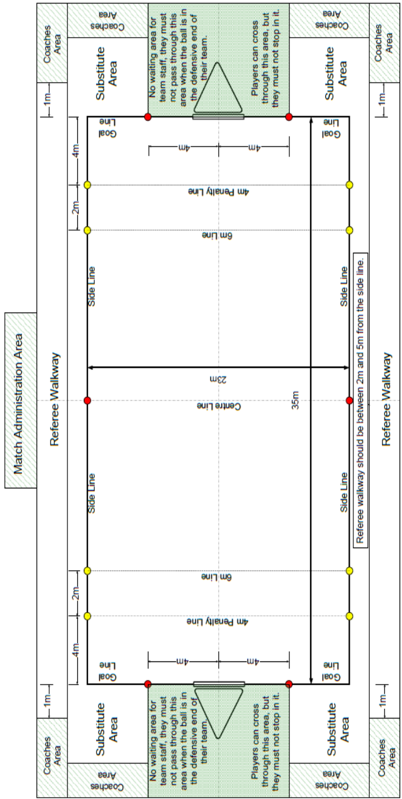

## **8.2 - PLAYING AREA – OVERVIEW** 

## **[SR]** 

8.2.1 - This is reserved during a game solely for the players in the game in progress, and immediately prior to the game for those players to use for continued warm-up. 

8.2.2 - A scoreboard must be maintained to clearly display the score to the players. Where the scoreboard has a clock, the scoreboard should be located on the centre line or where there are two (2) scoreboards they should be positioned in the same relative position at either end of the pitch, or both on the centre line. 

## **8.3 - PLAYING AREA – DEFINITION** 

**[SR]** 

8.3.1 - The playing area must be rectangular and have a length of thirty-five (35) metres and a width of twenty-three (23) metres. 

8.3.2 - The immediate surround of the playing area should be an unobstructed area of water, with a minimum width of one (1) metre outside all boundaries. 

8.3.3 - The water throughout the playing area must be still water at least ninety (90) centimetres deep. 

8.3.4 - There must be a clear height of at least three (3) metres without obstacles, and a minimum ceiling height of five (5) metres, above the playing area. 

8.3.5 - There should be a walkway on each side of the playing area kept clear for the Referees. 

## **8.4 - PLAYING AREA BOUNDARIES AND MARKERS** 

**[SR]** 

8.4.1 - The longer boundaries are to be referred to as the sidelines, the shorter boundaries as the goal lines. 

8.4.2 - The sidelines and goal lines are to be indicated by a floating lane rope. The section of the goal line four (4) metres either side of the centre of the goal frame should be free from floats so as not to interfere with the positioning of the goalkeeper. 

8.4.3 - Markers indicating the goal lines, centre line, six (6) metre and four (4) metre points from each goal line are to be placed along the sidelines and be clearly visible to both Referees and players. 

8.4.4 - Markers indicating the substitute areas are to be placed on the goal lines four (4) metres either side of the centre of the goal frame and be clearly visible to both Referees and players. 

## **8.5 - GOALS** 

**[SR]** 

8.5.1 - Principles 

8.5.1.a - Each goal will be located over the centre of each goal line with their lower inside edge two (2) metres above the surface of the water. 

8.5.1.b - Each goal is to be held in such a way that it is prevented from swinging or moving. 

8.5.1.c - The goal supports should not interfere with any player defending or manoeuvring around the goal area, or with the flight of the ball in the area of play. 

8.5.2 - Goal frame 

8.5.2.a - Each goal will consist of an open frame one (1) metre high by one and a half (1.5) metres wide (measured internally) hung vertically. 

8.5.2.b - The maximum width of a material used to construct the goal frame will be five (5) centimetres. 

8.5.2.c - The goal frames should not have any vertical or horizontal bars parallel to the main goal frame which may cause the ball to rebound out of the goal frame. 

8.5.2.d - The front face of the frame must be free from any loose netting, net fastenings or sharp edges which may impede the flight of the ball or damage the ball or players equipment. 

8.5.2.e - The front face of the frame must be red and white striped. Each stripe being of 20 centimetres length. 

8.5.2.f - For venues involving multiple fields all goals must be identical. 

## 8.5.3 - Net 

8.5.3.a - Each goal is to have a net made from a strong shock absorbing material, which allows the ball to pass freely through the goal frame but indicate clearly that a goal has been scored. 

8.5.3.b - The net must be a minimum of fifty (50) centimetres deep and have no loose or hanging ends which may interfere with players or their equipment or blow in the wind or that may impede the ball entering the goal. 

## **8.6 - BALLS** 

## **[SR]** 

8.6.1 - The ball must be round and must have an air chamber with a self-closing valve. It must be waterproof, without external strapping or any covering of grease or similar substance. 

8.6.2 - The weight of the ball will not be less than four hundred (400) grams and not more than four hundred and fifty (450) grams. 

8.6.3 - For games played by Men, Men Under-21 and Men Master: 

8.6.3.a - The circumference of the ball will not be less than sixty-eight (68) and not more than seventy-one (71) centimetres. 

8.6.3.b - The pressure of the ball will be according to the manufacturers recommendations. 

8.6.4 - For games played by Women, Women Under-21 and Women Master: 

8.6.4.a - The circumference of the ball will not be less than sixty-five (65) and not more than sixty-seven (67) centimetres. 

8.6.4.b - The pressure of the ball will be according to the manufacturers recommendations. 

## **8.7 - SUBSTITUTES AREA** 

## **[SR]** 

8.7.1 - The substitutes area is the area behind the goal line excluding the area four (4) metres either side of the centre of the goal frame. 

8.7.2 - These are reserved during a game for substitutes waiting to take part in a game. 

## **8.8 - REFEREE’S AREA** 

## **[SR]** 

8.8.1 - This is the area required by each Referee controlling a game to run up and down the side of the playing area. No person other than Game Officials are permitted to enter this area during a game. 

8.8.2 - The Referee's area should ideally be 2m and no more than 5m from the playing area. 

8.8.3 - The Referee's area should be separated from the spectator area by a distance of at least one (1) metre and a physical barrier sufficient to prevent any spectator touching or directly approaching the Referee. 

## **8.9 - WARM-UP AREA** 

## **[SR]** 

8.9.1 - The warm-up area is an area, which may be available outside the playing area and substitutes area for teams to warm-up prior to their game. 

8.9.2 - This must be separated from the playing area to prevent accidental entry of practice balls into the playing area. 

8.9.3 - This warm-up area will be reserved solely for the use of players preparing for the next game. 

## **8.10 - OFFICIALS AREA** 

## **[SR]** 

8.10.1 - This is a designated area around the pool, including behind the goals and behind the Referee's area. 

8.10.2 - Only people directly involved in the game in progress or the game about to commence (officials, players, listed team personnel such as coach, manager, doctor) or accredited media representatives, are permitted in the officials’ area during a competition. 

## **8.11 - COACHES AREA** 

## **[SR]** 

8.11.1 - This is a designated area starting one (1) metre behind the goal line and extending across the field behind the goal line (if a solid area exists) to the edge of the substitutes area on either side of the goal. 

8.11.2 - The area should be clearly marked. 

8.11.3 - Coaches and other team officials cannot pass through the area behind the goal when the ball is in their teams defensive end of the field. 

8.11.4 - A team is allowed a maximum of three (3) persons in the coaches area for games. These persons must be accredited and can comprise the Coach/es, Team Leader, any other Team Official and non-playing team athletes. The composition of these three (3) persons may change as a competition progresses but not during a particular game. 

## **8.12 - COMPETITION AREA** 

## **[SR]** 

8.12.1 - This is a wider area around the pool, including the playing, coaching, warm-up and Referee's areas, and may include designated rooms such as changing rooms, equipment storage area etc. 

8.12.2 - Spectators and the general public should be restricted from this area. 

8.12.3 - Any official may request the removal from this area of people interfering with the smooth running of the competition. 

## **CHAPTER 9 - PRE-COMPETITION** 

## **9.1 - COMPETITION SCHEDULE [SR]** 

9.1.1 - The competition schedule for an international competition will be sent out at least two (2) weeks prior to the competition. 

9.1.2 - The competition schedule determined once published, can only be modified with the approval of the HOC. Alterations must be notified in writing to all Team Leaders. 

9.1.3 - More than one (1) venue may be used for the early part of the competition. 

9.1.4 - The games of the final round must be held at the same venue. 

9.1.5 - A team should not be required to play at more than one (1) venue on any single day. 

9.1.6 - A team should not be required to play games spread over more than nine (9) hours on a single day. 

9.1.7 - A team should not be required to play its first game of the day less than 12 hours after its last game of the preceding day. 

9.1.8 - A team should not be required to play more than six (6) games on a day. 

9.1.9 - A team should not be required to play more than three (3) games in any period of four (4) hours. 

9.1.10 - A team should not be required to play a game less than half an hour after completion of its previous game. 

9.1.11 - A team must play at least one (1) game on the same day as and prior to playing in a grand final. 

## **9.2 - SCRUTINEERING** 

## **[SR]** 

9.2.1 - The times, places and procedures for scrutineering of playing equipment for entry to the competition area will be advised to all teams at least twenty-four (24) hours before the equipment needs to be scrutineered. Provision will be made for checking equipment into the competition area on each day prior to the start of the first game. 

9.2.2 - Scrutineers should inspect all playing equipment, prior to any admission to the competition area, for compliance with the rules. If equipment does not comply, it will not be permitted entry to the competition area.  If it does comply, it will be marked in a distinctive way clearly visible on inspection. 

9.2.3 - Personal protection equipment will be required to be inspected on the intended wearer to ensure suitability for the size of the intended wearer. 

9.2.4 - Players’ equipment is subject to scrutineering before, during or after a game. 

9.2.5 - A Referee must dismiss from the playing area, once aware of the infringement, any player whose equipment is in breach of the rules, either at the first break in play or immediately if the equipment is potentially dangerous. 

## **CHAPTER 10 - COMPETITION** 

## _**I - Game**_ 

## **10.1 - NUMBER OF PLAYERS** 

## **[SR]** 

- 10.1.1 - Each team may consist of a maximum of eight (8) players for any game. 

10.1.2 - No more than five (5) players are permitted on the playing area at any one time. Any other players at that moment are to be considered as substitutes. 

10.1.3 - If a team is reduced to two (2) players at any time the Referee must end the game and refer the matter to the Competition Committee who will decide the appropriate action to be taken. 

10.1.4 - The list of players names and numbers for a game must be handed to the appropriate official before the time indicated by the Competition Committee. 

## **10.2 - PLAYING TIME** 

## **[SR]** 

10.2.1 - Playing time should be two (2) periods each of ten (10) minutes duration, unless overtime is needed to decide the result. The minimum playing time will be two (2) periods of seven (7) minutes. 

10.2.2 - The half time interval should be three (3) minutes. The minimum half time interval will be one (1) minute. 

10.2.3 - The teams must change ends after each period of play. 

10.2.4 - The Referee may call time-out during the playing time. The Timekeeper will stop the clock when the Referee signals for time-out and restart the clock when the Referee restarts the game with a whistle. 

## **10.3 - CHOICE OF END** 

## **[SR]** 

The first named team on the game sheet will start on the goal line at the lefthand side of the official table unless one (1) of the captains or the Chief Official request a toss of a coin to determine the choice of ends. 

## **10.4 - COMMENCEMENT OF PLAY** 

## **[SR]** 

10.4.1 - At the beginning of each game (not each period), five (5) players from each team must line up stationary with any part of their kayaks on their own goal line. At the beginning of the second half and for any overtime periods, teams must line up but due to sanctions or injury may have less than 5 players starting. 

10.4.2 - If a player sprints before the referee whistles, a start infringement will be called. Signal 1 and 15 apply. 

10.4.3 - If a team deliberately causes an unnecessary delay a start infringement will be called. Signal 1 and 15 apply. 

10.4.4 - If a team has less than five (5) players ready to start the game five (5) minutes after the scheduled start time the game will be declared a forfeit and referred to the Competition Committee. Signal 2 applies. 

10.4.5 - The Referee blows the whistle to start play and then releases or throws the ball into the centre of the playing area. 

10.4.6 - If the ball is released or thrown giving one (1) team definite advantage, the Referee calls for the ball and restarts the period of play. 

10.4.7 - Physical assistance from other players is not allowed on the player attempting for the ball. Infringement incurs a free throw. Signals 1 and 14 apply. 

10.4.8 - Only one (1) player from each team may make an attempt to gain possession of the ball. All other players must not be within a radius of three (3) metres from the body of the player attempting for the ball until one (1) player has touched the ball with their hand/s. Infringement incurs a free shot. Signals 1 and 15 apply. 

**[SR]** 

## **10.5 - BALL OUT OF PLAY** 

## 10.5.1 - **Sideline and overhead obstacle** 

10.5.1.a - When any part of the ball touches the physical sideline or the vertical plane of the physical sideline, or touches any overhead obstacle, the team that was not the last to touch it with their paddle, kayak or person is awarded a sideline-throw. 

10.5.1.b - If the physical sideline is moved out of position as a consequence of normal play, the boundary including the vertical plane above moves with it. Signals 5 and 14 apply. 

10.5.1.c - Sideline throw: The player taking the throw must position their kayak at the point of exit of the ball, or the point on the sideline nearest to the point of contact with an overhead obstacle. 

## 10.5.2 - **Goal line throw** 

10.5.2.a - The goal line is always measured by the vertical plane of the goal frame in all situations even if the goal frame or the physical goal line are moved out of position as a consequence of normal play. A goal line or corner throw will be awarded when any part of the ball touches the vertical plane of the front of the goal frame except where a ball rebounds off the goal frame (not the goal supports) into the playing area, or where the ball is prevented from completely entering the goal by a defenders paddle and rebounds back into the field of play, or where a goal is scored. 

10.5.2.b - When the ball goes out over the teams own goal line and was last touched by the opposition then a goal line throw will be awarded. Signals 6 and 14 apply. The player taking the throw must be positioned with their kayak on the goal line. 

## 10.5.3 - **Corner-throw** 

10.5.3.a - When the ball goes out over the teams own goal line and was last touched by their own team then a corner throw will be awarded. 

10.5.3.b - Signals 5 and 14 apply. 

10.5.3.c - The player taking the throw must be positioned with their kayak in the corner of the playing area. 

## **10.6 - TIME-OUT** 

## **[SR]** 

10.6.1 - The Referee must use a triple whistle to stop the game for time-out, except when a goal is scored in which case a long whistle blast will be used. 

10.6.2 - Time-out must be given if a capsized player or their equipment is interfering with play. 

10.6.3 - Time-out should be used immediately when game regulations are dangerously breached or if field equipment needs correction or adjustment (for example: endangering another player due to a broken paddle). 

10.6.4 - Time-out should be used if any injury has occurred, or a player is illegally on the field, provided this does not disadvantage the other team. 

10.6.5 - Time-out must be used after a goal is scored and must be used if a goal penalty shot is awarded. It can be used for any other incidences at the discretion of the Referee. 

10.6.6 - If the Referee has stopped the game, not during a break in play and where neither team was at fault (e.g. Referee error, faulty goals, injury) the play will be restarted with a free throw to the team that last had possession. Where time-out was given for a capsized player the opposition is given a free throw to restart. 

10.6.7 - If the Referee cannot determine who had possession at the time of the whistle, the Referee will restart the game with a Referee’s ball. Signal 8 applies. 

## **10.7 - LIVE STREAM AND TIME OUT** 

## **[SR]** 

10.7.1 - In cases where live stream advertising is used the coach or team captain must on one (1) occasion ONLY during the game call a one (1) minute time out when they are in possession and outside the six (6) metre area. This must be called in the first seven (7) minutes of either half. As soon as the time out is called the live stream will show the approved advertising while the relevant team talk. Players must be ready to restart from the approximate same position as when time out was called as the minute expires. Restart will be by free throw - not direct throw. 

10.7.2 - If a time out is not called by the team after seven (7) minutes of the second half the Referee will call this time out. 

10.7.3 - If no time out has been called by either team after six (6) minutes of the second half the Referee will call a two (2) minute time out. 

10.7.4 - Live-stream advertising may only be used after quality checking and specific authorisation in writing before the competition: 

- World Games by ICF Secretary General 

- World Championships by ICF Chair in consultation with ICF Secretary General 

- Continental Championships by Continental President in consultation with Continental Technical Delegate 

- International competitions - national or club teams by Chief Official 

## **10.8 - SCORING A GOAL** 

## **[SR]** 

10.8.1 - A team scores a goal when the whole of the ball passes through the plane of the front of the goal frame of their opponent’s goal. If a goal is not rigidly fixed and moves the ball must go through the goal frame. The Referee will indicate the number of the player scoring the goal to the Scorekeeper. Signal 3 applies and one (1) long whistle blast by the Referee. 

10.8.2 - If the ball is prevented from entering a goal by either a defender's or substitutes paddle that enters the goal from behind, then a goal is awarded. 

## **10.9 - RESTART AFTER GOAL** 

## **[SR]** 

10.9.1 - After a goal is scored, the team that scored the goal must return to their own half as quickly as possible. Any deliberate delay will be sanctioned with a sanction card to the offending player(s) for Unsporting Behaviour for Deliberate Delaying Tactics Signals 15, 17 & 18 apply. 

10.9.2 - The first (1[st] ) Referee can restart play as soon as the attacking team are ready and at least three (3) players of the defending team have returned to their own half. No player of the defending team may take any part in the game until their body has crossed the centreline back to their defensive half of the field. Infringement incurs a sanction card to the offending player Signals 1, 15 and 17 apply. 

10.9.3 - The player taking the restart throw must position part of their body somewhere along the centre line of the playing area. The rest of the attacking team must not cross the centre line until the whistle is blown to restart play. The player taking the throw must be stationary and will indicate they are ready to take the throw by holding the ball up. The first (1[st] ) Referee will blow their whistle to restart play. 

## **10.10 - DEFENCE OF GOAL** 

## **[SR]** 

10.10.1 - The one defending player most directly under the goal, in order to defend the goal with the paddle is considered to be the goalkeeper at that time. The goalkeeper’s body must be facing into the playing area and attempting to maintain a position within one (1) metre of the centre of the goal line. If two (2) or more players are directly under the goal, the player most directly under the goal is considered the goalkeeper at that time. 

10.10.2 - If the goalkeeper is not in possession of the ball and is moved or unbalanced by contact from an opposing player, then that player has committed an illegal tackle. Infringement incurs a sanction. Signals 10 and 15 apply. 

10.10.3 - If an attacker moves the goalkeeper by pushing a defender into the goalkeeper, where none of the defenders have possession of the ball, the attacker **will be** penalised. 

10.10.4 - If the defender has an opportunity to avoid contact with the goalkeeper after being pushed, but does not, the attacker **will not be** penalised. 

10.10.5 - If a defender pushes the attacker onto the goalkeeper, then the attacker **will not be** penalised. 

10.10.6 - If the attacker has an opportunity to avoid contact with the goalkeeper after being pushed, but does not, the attacker **will be** penalised. 

10.10.7 - If an attacker, in possession of the ball, whose original direction or speed would not have led to contact with the goalkeeper is pushed onto the goalkeeper by a defender, the attacker will not be penalised. 

10.10.8 - A goalkeeper who is not in possession of the ball, but is attempting for the ball on the water, can be tackled like any other player. If the goalkeeper does not gain possession, they will not regain goalkeeper status until the attacker has shot or passed the ball. After the attacker loses possession of the ball, the attacker must not actively impede the goalkeeper's attempt to regain or maintain their position. 

10.10.9 - Within the six (6) metre area, an attacker must not actively prevent a defender from taking the position as goalkeeper. A defender will be allowed to push an attacker with the kayak, in order to take the position of goalkeeper without penalty, unless dangerous play is used. 

10.10.10 - As soon as a team has control of the ball they can no longer be considered to be defending and thus cannot have a player defined as a goalkeeper. 

**10.11 - REFEREE’S BALL [SR]** 

10.11.1 - A Referee’s ball will be declared when two (2) or more players of opposing teams have one (1) or more hands firmly on the ball, so that the players share possession of the ball for five (5) seconds. 

10.11.2 - If initial contact is made directly with the ball illegal holding will only apply if either player uses the opposition for support. 

10.11.3 - If the Referee needs to stop the game, not during a break in play and where neither team is at fault (e.g. Referee error, faulty goals, injury) and the Referee cannot determine who had possession at the time of the whistle, the Referee will restart the game with a Referee’ s ball. 

10.11.4 - A Referees ball will be taken at the nearest point on the sideline to the incident. Where a Referee’s ball is awarded for an incident that occurs between the six (6) metre line and the goal line, the Referee’s ball will be held at the nearest six (6) metre line. Signal 8 and Time-out applies. 

10.11.5 - Two opposing players will line up at right angles to the sideline, on the side nearest their own goal line, near to the sideline where the situation occurred, one (1) metre apart facing the Referee. They will place their paddles on the water, but not between their kayaks and their hands on the deck of the kayak or on their paddle. 

10.11.6 - All other players must be at least three (3) metres away from the point between the two (2) players participating in the Referees ball. 

10.11.7 - The Referee will throw the ball on the water between the players and blow the whistle to restart play. Both players must make an attempt for the ball with their hands as soon as it touches the water. The players must not play the ball before it hits the water. Infringement incurs a sanction. Signals 11 and 15 apply. 

## **10.12 - ADVANTAGE** 

## **[SR]** 

10.12.1 - The Referees can play advantage when an infringement occurs as long as neither Referee has blown their whistle. The Referees will play advantage if the team that was infringed upon is benefited more by play continuing. When playing advantage, the Referees must recognise the illegal play by calling 'play on' and signalling throughout the time they are playing advantage up to a maximum of five (5) seconds. Signals 13 and 14 apply. 

10.12.2 - The Referee can penalise any player who causes an infringement for which advantage is played at the next break in play with a sanction card. 

10.12.3 - When playing advantage, if the next pass or shot is affected by the original foul or there is no clear advantage to the fouled team, the original infringement must be called, and appropriate sanction(s) and signals given. The Referee is to indicate where the sanction should be taken. 

## **10.13 - CAPSIZED PLAYER** 

## **[SR]** 

10.13.1 - If a player capsizes and leaves their kayak, the player may not take any further part in the play and must leave the playing area immediately, with all of their equipment. 

10.13.2 - If a player who has capsized wishes to re-join the game the player must do so according to the rules of entry to the field of play. 

10.13.3 - No person may enter the playing area to assist a player with their equipment, and no-one may obstruct the Referee while assisting a player. 

10.13.4 - A team may be penalised during a game for any illegal outside assistance, or for any interference with the opposition that constitutes outside assistance. The Referee to determine the severity of the sanction. 

## **10.14 - ENTRY, RE-ENTRY, SUBSTITUTION AND EXCHANGING EQUIPMENT [SR]** 

10.14.1 - No more than the legally allowed number of players from a team can be on the playing area at any one time. 

10.14.2 - Substitutes must wait in their own substitute’s area. 

10.14.3 - Substitution is allowed at any time including during time outs. Exit and entry of players for substitution may be anywhere along the teams own goal line provided all of the player’s kayak and equipment has left the playing area before the substitute may enter the playing area. A player leaving the playing area solely as part of the action of the game is not subject to the conditions for re-entry. 

10.14.4 - A capsized player who leaves the playing area anywhere other than at their own goal line, can only be substituted at the next break in play. All of the capsized players equipment (for example kayak and/or paddle) must be removed from the playing area before a substitution is allowed. 

10.14.5 - Each player is permitted to leave the playing area and exchange any piece of equipment, at any time during the game, provided the equipment has been approved by the Scrutineer. The player concerned must collect equipment being exchanged from their substitute’s area. 

## **10.15 - OUTSIDE ASSISTANCE OR INTERFERENCE** 

## **[SR]** 

No electrical assistance may be used to direct or communicate with the players during a game, other than communications by competition officials. 

## **10.16 - COMPLETION OF PLAY** 

## **[SR]** 

10.16.1 - The Timekeeper will indicate the end of the period of playing time by the use of a loud signal. If the ball is in flight towards the goal at the time of the timekeepers signal the ball is allowed to travel to completion. For a goal to be scored, the ball must have left the players hand prior to the timekeepers signal sounding. The Referee must use signal 2 to confirm the Timekeeper's signal. 

10.16.2 - If a goal penalty shot has been awarded prior to the signal for completion of play, the goal penalty shot must be taken before play is to be considered complete. In this situation, the Referee will signal the end of play if a goal is scored **or** the shot is blocked by the goalkeeper **or** the shot rebounds away from the goal frame **or** the ball travels out of play. 

10.16.3 - All members and officials of a team must leave the playing, substitute and officials area’s immediately upon completion of their game. 

10.16.4 - They must also ensure that all their equipment is removed from these areas. 

## **10.17 - OVERTIME** 

## **[SR]** 

10.17.1 - Overtime will consist of consecutive periods of five (5) minutes each; with the team scoring the first goal deemed the winner. 

10.17.2 - There must be a three (3) minute break before overtime commences and a one (1) minute break between periods, with a change of ends. 

## _**II - Illegal-play**_ 

## **10.18 - ILLEGAL SUBSTITUTION AND ENTRY TO THE PLAYING AREA [SR]** 

10.18.1 - Where more than the legally allowed number of players from a team are in the playing area at any one time the player(s) coming illegally into the playing area must be given a sanction card(s). If it is not clear which player(s) must exit the playing area, then the team’s captain must nominate a player(s). Infringement incurs a sanction. Signals 7 and 14 apply. 

10.18.2 - When a substitute places their paddle in the playing area to prevent a goal from being scored, a goal penalty shot is awarded. The offending player is penalised with an Ejection  Red Card. Infringement incurs a sanction. Signals 16, 7 and 20 apply 

## **10.19 - ILLEGAL USE OF PADDLE** 

**[SR]** 

10.19.1 - Signals 12 and 15 apply. The following are defined as illegal use of the paddle. 

## 10.19.2 - Contacting an opponent’s person. 

10.19.3 - Playing, or attempting to play, the ball with a paddle when the ball is within arm’s reach of an opponent, and that opponent is attempting to play the ball with their hand. 

10.19.4 - Playing or attempting to play the ball with a paddle across the bow of an opponent’s kayak, within arm’s reach of the opponent in a normal paddling position. 

10.19.5 - Placing a paddle within arm’s reach of an opponent who has the ball in their hand. A goalkeeper is excluded from this rule and is allowed to directly defend against a shot at goal as long as the paddle is not moved towards the opponent at the time of the shot and it does not result in significant contact with the opponent. 

10.19.6 - When a player, with their paddle, attempts to restrict an opponent using their paddle. 

10.19.7 - Playing an opponent’s paddle instead of the ball. 

10.19.8 - Throwing a paddle. 

10.19.9 - Any other use of a paddle that endangers a player. 

## **10.20 - ILLEGAL POSSESSION** 

## **[SR]** 

10.20.1 - Signals 11 and 15 apply. A player is in possession of the ball when they have the ball in their hand or are in a position to reach the ball with their hand, the ball being on the water and not in the air. A player balancing the ball on their paddle will also be considered to be in possession. 

10.20.2 - A player must dispose of the ball within five (5) seconds of gaining possession, either by passing it to another player or by performing one (1) throw causing the ball to travel by at least one (1) metre measured horizontally from the point of release. 

10.20.3 - If a player shares possession with another player or the ball moves out of arms reach whilst being tackled, the five (5) seconds will begin again once a player has regained possession. 

10.20.4 - A player who capsizes to the point of the whole of their body and head going under water is considered to have lost possession if they do not have the ball in their hand(s). 

10.20.5 - A player must not manoeuvre their kayak with their hands or paddle while the ball is resting on their spray deck. 

10.20.6 - A player must not actively paddle or manoeuvre their kayak with two (2) hands on the paddle while carrying the ball in any way. 

## **10.21 - ILLEGAL HAND TACKLE** 

## **[SR]** 

10.21.1 - Signals 19 and 15 apply. A Hand-Tackle is a player pushing an opponent with one (1) hand. 

10.21.2 - The following hand-tackles are illegal: 

10.21.2.a - Any hand-tackle where the tackled player does not have possession of the ball or is sharing possession of the ball with another player. 

10.21.2.b - Any body contact other than one (1) open hand to the opponents’ back, upper arm or side. 

10.21.2.c - Any hand-tackle, which endangers the tackled player. 

10.21.2.d - Any hand-tackle from the side or from behind, that either strikes or pulls back the throwing arm of a player who is in the process of throwing or passing the ball. 

## **10.22 - ILLEGAL KAYAK TACKLE** 

**[SR]** 

10.22.1 - Signals 10 and 15 apply. 

10.22.2 - A kayak-tackle is a player manoeuvring their kayak against an opponent’s kayak in an attempt to gain possession of the ball. 

10.22.3 - The following kayak-tackles are illegal: 

10.22.3.a - Any kayak-tackle that results in significant contact between the tackler's kayak and the head or body of an opposing player or endangering a player. The player's arm is not considered to be part of the body when any part of it is elevated away from the body. 

10.22.3.b - Any deliberate kayak-tackle that results in significant or continuous contact with the opponent's spray deck or where the tackler continues to tackle into or over the spray deck. After a kayak tackle, when the ball is no longer in possession of either player, they may move off each other’s kayak by using their hands in a controlled action. 

10.22.3.c - A player in possession of the ball who fails to avoid significant contact between the bow of his kayak and the head or body of the opponent. 

10.22.3.d - Any hard tackle that results in significant contact to the side of the kayak, at an angle between eighty (80) and one hundred (100) degrees. 

10.22.3.e - Tackling an opponent who is not within three (3) metres of the ball. 

10.22.3.f - Tackling an opponent when the tackler is not competing for the ball. 

## **10.23 - ILLEGAL JOSTLE** 

## **[SR]** 

10.23.1 - Signals 9 and 15 apply. A jostle is a player manoeuvring their kayak against an opponent's kayak between the six (6) metre line and the goal line, at the attacking end of the field, to gain a position. The following jostling is illegal. 

10.23.2 - When a player is stationary or attempting to maintain a position and their body is moved by more than two (2) metres by sustained contact from an opponent’s kayak. 

10.23.3 - When the contact to the opponent's kayak would be defined as an illegal kayak tackle under any section of rule 10.22. 

10.23.4 - When the body of the jostled player is behind the goal line. 

**10.24 - ILLEGAL OBSTRUCTION** 

**[SR]** 

10.24.1 - Signals 9 and 15 apply. 

10.24.2 - The following obstruction is illegal: 

10.24.2.a - A player actively or deliberately impeding the progress of an opponent when neither player is within three (3) metres of the ball except where the players are jostling for position at the attacking end of the field as covered in rule 10.23. Note: A player is considered to be actively impeding the progress of an opponent when their kayak is moving, or they are attempting active paddle strokes. 

10.24.2.b - A player who is not competing for the ball who actively impedes the progress of an opponent who is competing for the ball on the water and not in the air. 

**[SR]** 

## **10.25 - ILLEGAL HOLDING** 

10.25.1 - Signals 19 and 15 apply. 

10.25.2 - The following holding is illegal: 

10.25.2.a - A player gaining support or propulsion by placing their hand, arm, body or paddle on an opponent’s kayak, or holding the opposing player or their equipment. 

10.25.2.b - A player using for propulsion or support, or moving out of place, any playing area equipment e.g. boundary markers, goal supports, or any surrounding object. 

10.25.2.c - A player using their paddle to lift, pull or hold an opponent’s kayak while jostling for position in the six (6) metre area, or attempting a kayak or hand tackle. 

10.25.2.d - A player fending off an opponent’s attempted hand or kayak tackle with their hand or forearm, or with the movement of the elbow towards their opponent. 

10.25.2.e - A defending player using one or both hands that results in contact with the opponents arm, or with the ball that is still in contact with the opponents hand, while they are in the act of shooting or passing, that affects the throwing action of the opponent. If the player who is attempting a shot or pass contacts the stationary hands or arms of a defending player, as part of the throwing action, the defending player will not be penalised. 

## **10.26 - UNSPORTING BEHAVIOUR** 

## **[SR]** 

10.26.1 - Signal 17 and 18 with appropriate sanction card applies. 

10.26.2 - The following is defined as unsporting behaviour: 

10.26.2.a - Any infringement committed by a player during a break in play. 

10.26.2.b - Hindering another player's attempt at righting themselves after capsizing. A player who is upside down must be allowed to get their head and both shoulders above the water before an opponent is allowed to attempt another tackle. 

10.26.2.c - Interference with the equipment of an opponent. Such as holding or moving another player's paddle out of their reach, or deliberately preventing the player from regaining possession of the paddle. 

10.26.2.d - Use of deliberate delaying tactics, such as throwing the ball away, or deliberately obstructing the opposition, to delay a quick restart after an infringement or goal. When a team is penalised, any player on that team who has possession of the ball must immediately place the ball on the water and not impede or delay the opposition in any way from taking a quick restart. 

10.26.2.e - Players showing dissent. 

10.26.2.f - Retaliation. 

10.26.2.g - Foul or abusive language. 

10.26.2.h - Other unsporting behaviour to a player, Referee or other official or behaviour considered harmful to the spirit of to the game at the discretion of the Referee including pretending or feigning injury. 

10.26.2.i - Bouncing the ball out of play off an opponent's kayak to gain advantage. 

## **10.27 - DISHONOURABLE PLAY** 

## **[SR]** 

10.27.1 - Any team, which plays a game other than by honourable means, will have such conduct considered by the Competition Committee. 

10.27.2 - The Competition Committee may take whatever action it sees fit and that team may be disqualified from the competition. 

10.27.3 - Team Leaders may discuss any concerns about the appointment of Referees or other officials on behalf of their teams with the Chief Official and / or Technical Organiser. 

10.27.4 - Any team member, team official or delegation member who approaches any other designated official e.g. Referee Manager/s about the appointment or performance of Referees will immediately be referred to the Competition Committee for disciplinary action which may result in that team being disqualified from the competition. 

## _**III - Sanctions**_ 

## **10.28 - SANCTIONS – DEFINITIONS** 

## **[SR]** 

10.28.1 - The Referee can impose any combination of the following sanctions for illegal-play depending on the severity and/or frequency of offences being penalised. 

10.28.2 - The sanctions available to the Referees are free throws, free shots, goal penalty shots and sanction cards. 

10.28.3 - The following definitions should be used when determining which sanction to impose: 

10.28.3.a - Deliberate foul: a foul where no effort was made to avoid the illegal play. A player's first (1st) deliberate foul will be indicated by the referee showing the player's number, directly after the signal for the foul. 

10.28.3.b - Dangerous foul: is significant contact with the opponent's arm, head or body that may result in personal injury and is illegal. 

10.28.3.c - Significant contact: any hard contact that may result in equipment damage or personal injury. 

10.28.3.d - The act of passing or shooting: begins when a player has the ball in their hand, or balancing on their paddle, and is clearly attempting to pass the ball to a teammate or shoot at goal. 

10.28.3.e - A near certain goal: The Referee must be certain that a goal was the most likely end result if play had continued. 

10.28.3.f - Control of the ball: A player is considered to have control of the ball if that player is in possession of the ball or is the nearest player to the ball and is within three (3) metres of the ball on the water. 

10.28.3.g - Team possession: a team is considered to have team possession and therefore be the attacking team if any member of that team has possession or control of the ball. 

## **10.29 - GOAL PENALTY SHOT** 

## **[SR]** 

10.29.1 - Signal 16 and time out applies. 

10.29.2 - Inside the six (6) metre area, a goal penalty shot will be awarded for any deliberate or dangerous foul on a player in the act of shooting. 

10.29.3 - Inside the six (6) metre area, a goal penalty shot will be awarded for any deliberate or dangerous foul on a player in the act of passing or positioning for a near-certain goal. 

10.29.4 - Inside the six (6) metre area, a goal penalty shot will be awarded for a deliberate or dangerous foul on a player who is attempting to take a free shot. 

10.29.5 - Outside the six (6) metre area, a goal penalty shot will be awarded for any deliberate or dangerous foul on a player in the act of shooting for a near-certain goal while the goal is not defended. 

10.29.6 - Outside the six (6) metre area, a goal penalty shot will be awarded for any deliberate or dangerous foul on a player in the act of passing or positioning for a near-certain goal while the goal is not defended. 

## **10.30 - FREE SHOT** 

**[SR]** 

- 10.30.1 - Signal 15 applies. 

## 10.30.2 - A free shot can be a direct shot at goal. 

10.30.3 - A free shot will be awarded for any foul on a player unless a goal penalty shot is awarded. 

**[SR]** 

## **10.31 - FREE THROW** 

10.31.1 - Signal 14 applies. 

10.31.2 - A free throw cannot be a direct shot at goal. 

10.31.3 - A free throw will be awarded for any ball out of play, or when a goal penalty shot, or free shot has not been awarded. 

10.31.4 - A free throw cannot be a direct shot at goal. Infringement incurs a sanction and the opposition is awarded a free throw. Signals 11 and 14 apply. Sideline throws, goal line throws, corner throws and centre restarts are considered to be free throws. 

## **10.32 - SANCTION CARD SYSTEM** 

**[SR]** 

10.32.1 - Sanction cards relate only to an individual. 

10.32.2 - A player can receive a maximum of three (3) sanction cards in any one game. 

10.32.3 - There are two ways the sanction card system can impact a player: 

10.32.3.a - The player receives an Ejection Red Card. This player is excluded for the rest of that game and suspended for the following game. The team cannot replace this player. 

10.32.3.b - As a game progresses the player receives 1st card (green) then 2nd card (yellow) and then the 3rd and final card (red) at which point that player is excluded for the rest of that game. A Player receiving a sanction Red Card is excluded from the field of play for the remainder of the game and cannot be replaced for a period of two (2) minutes. 

10.32.4 - A referee may move straight to the 2nd or 3rd card level (yellow or red) for any deliberate foul that in the Referee's opinion is of major influence to the game. 

10.32.5 - A player receiving a Red Card or Ejection Red Card during a competition can be referred to the Competition Committee for further disciplinary action by either Referee if they feel further action or sanctions are necessary. 

## **10.33 - POWER PLAY – DEFINITION** 

## **[SR]** 

10.33.1 - A player that receives an Ejection Red Card is sent off for the rest of the game and cannot be replaced. The opposition will benefit from the power play for the remainder of the game. 

10.33.2 - A player receiving their 1st or 2nd sanction card is excluded from the field of play and cannot be replaced for a maximum period of two (2) minutes. 

10.33.3 - A player receiving their 3rd sanction card, is excluded from the field of play and cannot be replaced for two (2) minutes. 

10.33.4 - If a goal is scored by the opposition during a power play, that does not involve an Ejection Red Card, the excluded player or a team-mate can return to the field of play and general play will resume with a centre restart. 

10.33.5 - Timing of the power play is suspended for periods of time out or between periods of play. 

10.33.6 - If more than one player from the same team have received a sanction card at the time when the opposition scores, only the first excluded player or a non-excluded team-mate can return to the field of play. The remaining power play(s) must be served in full unless the opposition score again. 

## **10.34 - EJECTION RED CARD** 

## **[SR]** 

10.34.1 - A player is sent off for the rest of the game and cannot be replaced. Signal 20 with red card and verbal statement “ejection red” to the player applies. 

10.34.2 - An Ejection Red Card must be awarded if a personal attack on a player occurs or if a player receives a red card (following green and yellow) and it is disputed. 

10.34.3 - An Ejection Red Card should be awarded for a repeated deliberate or dangerous foul, that in the Referee's opinion is of major influence to the game or injures/ risked injury to another player. 

10.34.4 - A player receiving an Ejection Red Card during a competition will automatically receive a one (1) game suspension and be unable to take part in the next game in that competition 

10.34.5 - An Ejection Red Card will be awarded to any player, coach or team official who approaches or talks to any referee or game official in a threatening, abusive or aggressive way during or after a game while in the field of play or competition area. 

## **10.35 - GREEN, YELLOW AND RED SANCTION CARDS [SR]** 

10.35.1 - Signal 17 with appropriate card applies. 

10.35.2 - A sanction card will be awarded to a player who commits a repeated deliberate foul OR a deliberate foul which has a significant influence on the game **.** 

10.35.3 - A sanction card will be awarded to a player who commits a dangerous foul that results in significant contact by their own kayak, paddle or body with the opponent's arm, head or body that may result in personal injury to the opponent or damage to their equipment. 

10.35.4 - A sanction card will be awarded to the offending player who commits a deliberate **OR** dangerous foul for which the Referee awards a goal penalty shot. 

10.35.5 - A sanction card will be awarded for a deliberate **OR** dangerous foul that is repeated while the Referees are playing advantage unless an Ejection Red Card is awarded. A sanction card awarded after the referee(s) have played advantage will take effect from when the sanction card is awarded, not from when the foul occurred. 

10.35.6 - A sanction card will be awarded for any deliberate contact with the kayak of an opponent who is trying to take a or free shot, corner, side-line or goal line throw. 

10.35.7 - A sanction card will be awarded for repeated and continuous disputing of Referee's decisions. 

10.35.8 - A sanction card will be awarded for foul or abusive language directed at an opponent or official. 

10.35.9 - A sanction card will be awarded to a player, for unnecessary verbal communication directed at a Referee, official or opponent, or any other unsporting behaviour except where an Ejection Red Card is awarded. 

10.35.10 - Players sent off must obey the rules of entry to the playing area for re-entry at the completion of the send-off period. 

## **10.36 - TEAM OFFICIALS AND COACHES** 

## **[SR]** 

10.36.1 - A coach or team captain can, at an appropriate moment, ask for clarification of a specific decision by the referees but only: 

10.36.1.a - At half time or conclusion of the game. 

10.36.1.b - When the ball is out of the playing area. 

10.36.2 - No communication with the referees is allowed when the ball is in play or when the referees are actively performing their game duties. Other team officials must not communicate with the referees. 

10.36.3 - A coach or team captain must not: 

10.36.3.a - Communicate with the referee while the ball is in play, when the referees are actively performing their duties or when it is not half or full time. 

10.36.3.b - Be disrespectful in words or gestures and/or engage in excessive verbal communication towards a Referee, official or opponent, or engage in any other unsporting behaviour. 

10.36.3.c - Leave the coaches area during play except where an Ejection Red Card is awarded. A Team Captain is excluded from this rule if they are playing the game. 

10.36.4 - Any breach of these rule must be penalised by one green card that will apply to all coaches and team officials from that team for the duration of that game.  Signal 17 with green card applies. 

10.36.5 - The one green card will be issued either immediately or at the next break in play at the discretion of the Referee. 

10.36.6 - The one green card to a group of coaches and team officials is a warning without exclusion. 

10.36.7 - An Ejection Red Card will be the next card awarded to a coach or team official after a green card warning has been given to any coach or team official from that team. Signal  20 with red card applies. 

10.36.8 - A coach or team official receiving an Ejection Red Card must immediately leave the competition area and cannot be replaced. The game will not continue until they have left the competition area and they may take no further part in the game and cannot communicate with the players and coaches remaining. 

10.36.9 - If the individual refuses to leave the competition area the Referees will abandon the game and refer the matter to the Competition Committee. 

10.36.10 - A team coach or team official receiving an Ejection Red Card during a competition will automatically receive a one (1) game suspension and be unable to take part in the next game in that competition. The individual must stay outside of the competition area and the spectator’s area during this game and cannot communicate with the players and coaches remaining during these games. 

_**IV - Restart after a sanction**_ 

## **10.37 - TAKING THROWS** 

## **[SR]** 

10.37.1 - The player taking any goal line throw, corner throw, sideline throw, free throw or free shot must be in the correct position and stationary before taking the throw. The player must clearly hold the ball stationary for a moment above shoulder level to indicate they are taking the throw. The players initial throw must travel one (1) metre measured horizontally from point of release by the player or change possession to another player of the same team. Infringement incurs a sanction with the opposing team being awarded possession of the ball. Signals 11 and 14 apply. 

10.37.2 - When taking any free throw, or free shot, the player taking the free throw or free shot must be allowed to take up their position to take the throw. No opponent may prevent the player taking up their position or contact the player or their equipment, or deliberately prevent or restrict the movement of the player taking the throw until the ball is back in play. Infringement occurs a sanction Signals 1 and 15 or 16 apply. 

10.37.3 - The ball is not in play until it has travelled one (1) metre measured horizontally from point of release by the player or changed possession to another player of the same team. The opposition must not attempt to prevent the ball from travelling one (1) metre measured horizontally or changing possession. Infringement incurs a sanction. Signals 1 and 15 or 16 apply. The only exception will be for Free Shots awarded within two (2) metres of the goal: Defenders (including the goalkeeper) will be allowed to block the free shot after release, but before it has travelled 1 metre from the point of release, with a stationary paddle or stationary hand(s). All defender’s paddles and hands must be kept out of arms reach and any movement towards the player taking the free shot by either a paddle or hand(s), or blocking the ball before it has been released will be deemed a deliberate action and result in a goal penalty shot being awarded. 

10.37.4 - The player must throw the ball within five (5) seconds of being in possession and in a position to take the throw. The five (5) seconds for the restart applies from when any member of the team is in a position to pick up the ball and take the throw. Any dropping or fumbling of the ball will not be considered, provided the initial throw is taken within the five (5) seconds. Infringement incurs a sanction with the opposing team awarded possession of the ball. Signals 11 and 14 applies. 

10.37.5 - Following an infringement that led to the awarding of a free shot or free throw, the Referee will indicate where the free shot or free throw will be taken. The free shot or free throw will be taken: either where the infringement occurred, or where the ball was at the time of the infringement, or where the ball landed if it was in flight at the time of the infringement, whichever most advantages the team. 

## **10.38 - TAKING A GOAL PENALTY SHOT** 

**[SR]** 

10.38.1 - Definition 

10.38.1.a - Signal 16 and sanction card (or Ejection Red Card if appropriate) apply. 

10.38.1.b - A Goal Penalty Shot (GPS) is a shot at goal between one (1) attacking player and one (1) goalkeeper. 

10.38.1.c - No other player can take any part in the play until the shot at goal is attempted. 

10.38.2 - General play will resume after the shot at goal has been attempted. 

10.38.3 - The player taking the goal penalty shot will be stationary with their body on the four (4) metre line. The goalkeeper of the defending team will be in position under the goal frame with their body within one (1) metre of the centre of the goal. The goalkeeper must remain stationary in this position until after the shot is taken. Infringement will result in the penalty being retaken. 

10.38.4 - All other players and their equipment must be positioned behind the six (6) metre line. Only substitutes or players sent off may be behind the goal line. Entry into the six (6) metre area before the Goal Penalty Shot is taken will result in the penalty being retaken if not scored and a sanction card to the offending player(s). 

10.38.5 - The shot will be taken when Referee blows the whistle. The five (5) second rule applies. When the Referee blows the whistle, the player taking the goal penalty must shoot from a stationary position. No presentation of the ball is required. 

10.38.6 - General Play will resume for all players on the field once the ball has left the hand of the player taking the penalty. 

10.38.7 - The player taking the shot can play the ball again if the shot is blocked by the keeper or rebounds off the goal frame back into the field of play. 

10.38.8 - The person committing the foul that caused the penalty must be given a sanction card (or direct red if appropriate). 

## **CHAPTER 11 - POST-COMPETITION** 

## **11.1 - PROTEST TO COMPETITION COMMITTEE** 

## **[PR]** 

11.1.1 - A Team Leader may lodge a protest in accordance with these rules. Such protests must be made to, and determined by, the Competition Committee. The Competition Committee may permit a protest to be made by two (2) or more Team Leaders jointly where in the Competition Committee’s opinion their grievance arises out of the same decision. 

11.1.2 - Objections about scrutineering decisions may be made verbally without fee by a Team Leader to a Scrutineer or the Chief Scrutineer before or during a game in which the equipment is involved. If the objection is made before the game, the equipment may be re-scrutinised. If a scrutineering objection is made during a game the Scrutineer will decide whether the Referee should call the player in to have their equipment inspected. 

11.1.3 - All decisions of the Referees on questions of fact are final and their interpretation of the rules must be obeyed throughout the game. No protest can be made in relation to an interpretive decision of a Referee. 

11.1.4 - Any protest must be made: 

11.1.4.a - Within twenty (20) minutes after the game of the incident that resulted in the protest, and be accompanied by a fee of 75 Euros which will be refunded if the protest is upheld; or 

11.1.4.b - Not later than one (1) hour before the start of the game where the protest is against the right of a player or team to participate in a game and be accompanied by a fee of 75 Euros which will be refunded if the protest is upheld. 

11.1.5 - The Team Leader (or his/her representative) must make the notice of protest to the Chief Official in writing setting out: 

11.1.5.a - The incident in question 

11.1.5.b - The grounds upon which the protest is made 

11.1.5.c - The reasons or circumstances supporting the alleged grounds of protest. 

11.1.6 - Nothing in the rules prevents the withdrawal of a protest by a Team Leader at any time by writing to the Chief Official. 

11.1.7 - On receipt of a protest in accordance with the rules, the Chief Official must immediately forward the notice of protest and any accompanying documents to the Competition Committee. 

11.1.8 - The Competition Committee will, as soon as practical after receiving a protest, investigate and consider the protest and should within ten (10) minutes of receiving such notice determine whether: 

11.1.8.a - The protest should be dismissed, because in its determination, the protest is trifling in nature or has no merit 

or 

11.1.8.b - The protest warrants further review and determination in accordance with these rules. 

11.1.9 - If the Competition Committee determines the matter warrants further review in accordance with these rules, it should as soon as practicable, having regard to the proximity of relevant events, call a meeting of the Competition Committee. 

11.1.10 - When a protest is made against a player or a team, the Team Leader of the player or team in question will be presented with a copy of the protest to read. 

11.1.11 - The Competition Committee may conduct a meeting (or any adjournment it permits) in such manner as it sees fit, but should: 

11.1.11.a - Give to the protesting Team Leader the opportunity to be heard 

11.1.11.b - Give due consideration to any statement given by the protesting Team Leader and any relevant official 

11.1.11.c - Allow the protesting Team Leader to be present along with their representative 

11.1.11.d - May request or require the protesting Team Leader or any other witness to attend the meeting or provide such evidence as is available 

11.1.11.e - Give the Team Leader (or their representatives) of any team that may be directly affected by the protest every opportunity to be heard 

11.1.12 - Following consideration of all relevant and available information, the Competition Committee must arrive at a finding. A decision of the Competition Committee can be by a majority decision. The Competition Committee may: 

11.1.12.a - Disqualify a team or exclude them from further competition. 

11.1.12.b - Where eligibility protest against a team is upheld, disqualify the team from the competition. When a team is disqualified, insofar as is possible, the results of all previous games the team has played in the competition will be nullified or awarded to their opponents, as appropriate. Any awards of medals, trophies or placing will be rescinded. 

11.1.12.c - Take such other action as it thinks fit and, in each case, must give written reasons for its decision. 

11.1.13 - The Chief Official will then immediately notify the protesting Team Leader and all other relevant people of the Competition Committee’s decision in writing. 

## **11.2 - DISCIPLINARY ACTION BY THE COMPETITION COMMITTEE [SR]** 

11.2.1 - The Competition Committee may summon any delegation member, to appear before a meeting of the Competition Committee convened in accordance with these rules for the purpose of investigating a matter if in the opinion of the Competition Committee there is reason to believe that they have: 

11.2.1.a - Failed to comply with any of the provisions of these rules. 

or 

11.2.1.b - Conducted themselves in a manner considered to be injurious or prejudicial to the character or interests of the Competition. 

11.2.2 - The Competition Committee may conduct a meeting (or any adjournment it permits) in such manner as it sees fit, but: 

11.2.2.a - Should give to the summoned delegation member every opportunity to be heard. 

11.2.2.b - Should give due consideration to any statement given by the summoned delegation member and any relevant official. 

11.2.2.c - Should allow the summoned delegation member to be present along with their representative; and 

11.2.2.d - May request or require the summoned delegation member or any other witness to attend the meeting or provide such evidence as is available. 

11.2.3 - Following consideration of all relevant and available information, the Competition Committee must arrive at a finding.  A decision of the Competition Committee can be by a majority decision. The Competition Committee may: 

11.2.3.a - Reprimand a player. 

11.2.3.b - Fine a delegation member or team. 

11.2.3.c - Suspend an individual member from participating in part or all of the Competition. 

11.2.3.d - Take such other action as it thinks fit and, in each case, must give written reasons for its decision. 

11.2.4 - The Chief Official will immediately notify the Team Leader of the summoned delegation member and all other relevant people of the Competition Committee’s decision in writing. 

## **11.3 - RESULTS** 

## **[SR]** 

The HOC should send the results of each competition within ten (10) days to the ICF Canoe Polo Committee, to each National Federation with teams participating, and to each Team Leader where non-national teams are concerned. 

## **CHAPTER 12 - WORLD GAMES** 

Rules in this chapter, specifically for World Games are in addition to, or to override, those in earlier chapters. 

## **12.1 - QUALIFICATION SYSTEM - PRINCIPLES** 

## **[SR]** 

12.1.1 - The International World Games Association (IWGA) in consultation with the ICF will agree the events, the number of team per event and the number of player places per team available. 

12.1.2 - Eligible National Federations will be invited based on their final position at the World Championships in the year prior to the World Games. 

12.1.3 - Qualification in each event will be a specified number of teams from the World Championships ranking, making allowance for continental representation and the host country. 

12.1.4 - The continental representation and host representation will be subject to specified ranking positions. 

12.1.5 - The details of the qualification system will be published as an appendix (see chapter 18) by the ICF before the qualifying World Championships after agreement with the IWGA. 

## **12.2 - COMPETITION FORMAT** 

## **[SR]** 

12.2.1 - The IWGA in consultation with the ICF will agree the competition format. 

12.2.2 - The seeding for the first round will be in accordance with the result of most recent ICF Canoe Polo World Championships prior to the World Games. 

## **12.3 - TRADEMARKS, ADVERTISING SYMBOLS AND WORDS** 

## **[SR]** 

12.3.1 - Trademarks, advertising symbols and words must be identical and in the same position on the kayaks and clothing of all players. 

12.3.2 - Any kayak, accessory, or article of sportswear, which does not comply with the above-mentioned conditions will be ineligible for use during a competition. 

12.3.3 - National Federations are responsible for ensuring their own equipment meets these rules and regulations. 

## **12.4 - PLAYING AREA** 

**[SR]** 

The use of existing facilities by the IWGA may necessitate variation to the field of play regulations (Chapter 8). 

## **12.5 - COMPETITION SCHEDULE** 

**[SR]** 

12.5.1 - A team should not be required to play its first game of the day less than 12 hours after its last game of the preceding day. 

12.5.2 - A team should not be required to start more than two (2) games in any period of four (4) hours. 

12.5.3 - A team should not be required to start a game less than one (1) hour after completion of its previous game. 

12.5.4 - A team must play at least one (1) game on the same day as playing in a grand final. 

## **12.6 - REFEREES** 

**[SR]** 

12.6.1 - The ICF Canoe Polo Committee will invite an appropriate number of ICF Referee's based on their current ranking, continental and country representation, recent refereeing history and location of the World Games. 

12.6.2 - It may be necessary to impose a fee on participating teams to cover the costs of any Referees invited. 

12.6.3 - Details of fees and associated regulations for World Games will be communicated by the ICF. 

## **CHAPTER 13 - WORLD CHAMPIONSHIPS** 

Refer to the International Competition Rules except as amended in this chapter. 

It is recommended that the majority of the rules in this chapter are used for Continental Championships, with any reference to the ICF substituted by the relevant Continental Association. 

## **13.1 - ORGANISATION** 

## **[PR]** 

13.1.1 - World Championships will be arranged with the consent of the ICF Board of Directors and are open to national teams of National Federations. 

13.1.2 - World Championships is held in even-number years at a place and time in accordance with the ICF Canoe Polo rules and the ICF Canoe Polo World Championship Manual. 

13.1.3 - The entries in each event is limited to the National Federation qualified after the qualification phase for the World Championships. 

## **13.2 - COMPETITION PROGRAMME** 

## **[PR]** 

World Championships will be held for the following events: 

|M|Men|
|---|---|
|W|Women|
|MU21|Men under 21|
|WU21|Women under 21|

## **13.3 - COMPETITION FORMAT** 

## **[SR]** 

13.3.1 - The competition in each event will be run in several rounds. The ICF Canoe Polo Committee will decide the number of rounds per event. 

13.3.2 - The seeding for the first round will be in accordance with the ICF Canoe Polo World Ranking (see chapter 18). 

## **13.4 - QUALIFICATION PHASE FOR THE WORLD CHAMPIONSHIPS** 

## **[SR]** 

13.4.1 - The qualification phase is held in two (2) stages. 

13.4.2 - The first qualification stage takes place at the previous World Championships where a specified number of teams will provisionally qualify subject to ratifying this place by competing in the following year’s Continental Championship. 

13.4.3 - The second qualification stage will be held at the Continental Championships in the year prior to the World Championships to decide the remaining Continental places. 

## **13.5 - QUALIFICATION SYSTEM FOR WORLD CHAMPIONSHIPS** 

## **[PR]** 

13.5.1 - The Canoe Polo Committee will publish in due time the Qualification System for Canoe Polo World Championships as an appendix (see chapter 18) no later than the 1[st] May in the year following the previous World Championships. 

13.5.2 - This document will detail: 

13.5.2.a - The total number of places available in each event at the World Championships. 

13.5.2.b - The number of places allocated at the 1[st] stage of the qualification phase for each event. 

13.5.2.c - The number of places allocated at the 2[nd] stage of the qualification phase for each continent for each event. 

13.5.2.d - The procedure in the case of a Continental Championships not taking place. 

13.5.2.e - Wildcards 

13.5.2.f - Timeline and process to accept a qualification place 

13.5.3 - Except in the case of extenuating circumstances as determined in the sole discretion of the ICF Canoe Polo Committee, any team withdrawing from a World Championship after accepting the allocated place by the ICF will not be eligible to enter the next World Championship. They are eligible for Continental Championships but cannot re-qualify via the continental place. 

## **13.6 - ENTRIES** 

## **[PR]** 

13.6.1 - Any charges (e.g. participation fee) must be agreed in the contract between the ICF and the HOC. 

13.6.2 - All matters relating to qualification phase and accepting the allocated place are managed by the ICF Canoe Polo Committee. 

13.6.3 - Team invitation(s) acceptance or decline must be confirmed in writing by the 10[th] January in the year of the world championships and this must be in accordance with the qualification and invitation criteria. 

13.6.4 - Wildcard invitations must be confirmed in writing by 31[st] March at the latest. 

13.6.5 - Numerical entries must be made at least eight (8) weeks prior to the competition using the ICF online entry system following the regulations given in the invitation. 

13.6.6 - Nominal entries must be made in accordance with rule 1.6.1. 

## **13.7 - FIELD OF PLAY** 

**[SR]** 

13.7.1 - The venue must have a minimum of four (4) playing areas. 

13.7.2 - For each playing area a warm-up area with two (2) goals must be provided. 

## **13.8 - THE BALL** 

**[SR]** 

The ICF Canoe Polo Committee must specify the colour and brand of the balls to be used. 

## **13.9 - COMPETITION COMMITTEEE** 

## **[PR]** 

13.9.1 - The Competition Committee will consist of three (3) officials who are in possession of a valid International Official Card, related to the discipline. 13.9.2 - They must belong to different national federations. 

## **13.10 - APPOINTEMENT OF THE OFFICIALS** 

## **[SR]** 

13.10.1 - The following groups are responsible for appointing the following officials: 

|officials:||
|---|---|
|**Chief Official**|**ICF Board of Directors**|
|Competition Organiser Technical Organiser Referee Manager/s Chief Scrutineer Chief Table Official Medical Official|Host Federation ICF CAP Committee ICF CAP Committee ICF CAP Committee ICF CAP Committee after proposal by Host Federation Host Federation|

13.10.2 - The Medical Official will oversee the Anti-Doping Control and the welfare of the delegation members and competition personal. 

**13.11 - REFEREES / OFFICIALS – APPOINTMENT [SR]** 

13.11.1 - The maximum number of officials to officiate the World Championships is eight (8) per game, excluding the Jury, Chief Official, Competition Organiser, Technical Organiser, Referee Manager/s, Chief Scrutineer and Chief Table Official. 

13.11.2 - Referee's will be selected by the ICF Canoe Polo Committee from the total list of ICF Referee's based on their current ranking, and recent refereeing history. 

13.11.3 - The number of Referees invited per continent will be based by percentage when compared against the most diverse event at the last World Championships. This will accordingly self-adjust as continents develop. 

13.11.4 - At least one (1) Referee will be invited from all five (5) continents provided they are Grade B or above. 

13.11.5 - All invited referees and referee managers must sign agreement to the current ICF Canoe Polo referee code of conduct (Chapter 19 – appendix 4) 

13.11.6 - Neutral Referees must referee all games, i.e. from National Federations other than those represented by the two (2) teams playing. 

## **13.12 - REFEREES / OFFICIALS – TRAVEL COSTS** 

## **[PR]** 

13.12.1 - Each team attending the World Championships will pay a fee (set by the ICF CAPC) to share the travel costs of 28 ICF qualified Referee's and all other officials to officiate at the World Championships. 

13.12.2 - This fee must be paid to the ICF by a date set by the ICF CAPC. 

13.12.3 - The HOC will be responsible for the full board accommodation and local transportation for all officials during the World Championships access period. 

## **13.13 - COMPETITION SCHEDULE** 

**[SR]** 

13.13.1 - A World Championships cannot extend over more than six (6) successive days. 

13.13.2 - A team should not be required to play games with their scheduled start spread over more than nine (9) hours on a single day. 

13.13.3 - A team should not be required to play its first game of the day less than 12 hours after its last game of the preceding day. 

13.13.4 - A team should not be required to play more than four (4) games on a day. 

13.13.5 - A team should not be required to start more than two (2) games in any period of four (4) hours. 

13.13.6 - A team should not be required to start a game less than one (1) hour after completion of its previous game. 

13.13.7 - A team must play at least one (1) game on the same day as playing in a grand final. 

## **13.14 - TRADEMARKS, ADVERTISING SYMBOLS AND WORDS** 

## **[SR]** 

13.14.1 - Trademarks, advertising symbols and words must be identical and in the same position on the deck of the kayaks and clothing of all players. 

13.14.2 - On the kayak front deck, the area above the kayak seams and extending 35cm from the front of the cockpit is reserved for a boat sticker incorporating ICF logo, competition logo, competition sponsor logo with the option also of country code for teams. Should this area not be required by ICF/HOC this will be notified via championship bulletin at least three (3) months before the competition opening ceremony. 

13.14.3 - On the front of the helmet an area 7cm x 4cm is reserved for an ICF or ICF Sponsor sticker. Should this area not be required by ICF/HOC this will be notified via championship bulletin at least three (3) months before the competition opening ceremony and players should apply their country flag to this area. 

13.14.4 - Members of a team may have different trademarks, advertising symbols and words below the seam of the kayak and on the spraydeck. 

13.14.5 - Any kayak, accessory, or article of sportswear, which does not comply with the above-mentioned conditions will be ineligible for use during a competition. Teams are responsible for ensuring their own equipment meets these rules and regulations. 

**13.15 - IDENTIFICATION** 

**[SR]** 

The players of a team can only be numbered 1 to 10. 

**13.16 - PLAYING TIME** 

**[SR]** 

13.16.1 - Playing time must be two (2) periods each of ten (10) minutes, unless overtime is needed to determine a result. There will be no shorter minimum playing time. 

13.16.2 - The half time interval must be three (3) minutes. There will be no shorter minimum half time interval. 

13.16.3 - A scoreboard must be maintained to clearly display the time remaining in any period and score to the players, officials. The scoreboard will automatically indicate the end of the period of playing time by the use of a loud signal. 

13.16.4 - Shot Clock will be used throughout World Championships (see chapter 17). 

**13.17 - EJECTION RED CARD IN A FINAL [SR]** 

A player receiving an Ejection Red Card in a final will be referred to their National Federation for consideration of any disciplinary action. 

**13.18 - APPEAL TO THE JURY [PR]** 

13.18.1 - An appeal against a decision of the Competition Committee must be addressed to the Chairman of the Jury in writing and be accompanied by a fee of 75 Euros (or equal amount in the currency of the country in which the championships are arranged). 

13.18.2 - The appeal must be handed to the Chairman of the Jury not later than 20 minutes after the Team Leader has been informed with a written communication of the decision against the player or team and has signed the receipt given. 

13.18.3 - The fee will be refunded if the appeal is upheld. 

13.18.4 - At the World Championships the decision of the Jury is final. 

**13.19 - AWARDS** 

**[PR]** 

13.19.1 - In addition to the awarded medals to the players, a medal will be awarded to the coach. 

13.19.2 - A perpetual trophy will be presented to the winning team in each event. 

## **13.20 - NATIONS CUP** 

## **[PR]** 

13.20.1 - One (1) Nations Cup in Canoe Polo will be awarded for the “Overall” winning National Federation based on the number of gold medals the teams from a National Federation have earned. 

13.20.2 - In the case of a tie in the number of gold medals, the number of silver medals is taken into consideration, and then the number of bronze medals. 

13.20.3 - If two (2) or more National Federations have an equal number of gold, silver, and bronze medals, they obtain the same rank and they are ordered in the table alphabetically by their NOC code. 

## **CHAPTER 14 - INTERNATIONAL TECHNICAL OFFICIALS – TRAINING PATHWAY** 

**This chapter define the dedicated aspect of the Canoe Polo international technical official training pathway in addition of the ICF sport governance rule 1.15.** 

## **14.1 - DEFINITION** 

**[PR]** 

14.1.1 - The ICF Canoe Polo Committee gives recognition as an **international Canoe Polo official** to those persons who have passed an appropriate examination. 

14.1.2 - Games of International competitions must be refereed by at least one (1) **international Canoe Polo Referee** who is an accredited referee in possession of a valid International Canoe Polo Referee card. 

**14.2 - INTERNATIONAL CANOE POLO OFFICIAL** 

**[SR]** 

14.2.1 - The candidates should have experience as a National Official related to the discipline concerned. 

14.2.2 - The ICF Canoe Polo committee will approve a person to conduct any written examination. 

14.2.3 - Successful candidates will be issued an international official’s card discipline related for a period of four (4) years. 

14.2.4 - The card can be renewed for further periods of four (4) years if the National Federation of the cardholder sends this card to the chairperson of the ICF Canoe Polo Committee within two (2) months of the expiry date. 

14.2.5 - Candidates, who have failed one (1) examination, can enrol for another examination, but not earlier than the following year. 

## **14.3 - INTERNATIONAL CANOE POLO REFEREE** 

## **[SR]** 

14.3.1 - The ICF Canoe Polo Committee gives recognition as an international Canoe Polo Referee to those persons who have passed an appropriate examination. 

14.3.2 - The candidates should have experience as a National Canoe Polo Referee in their National Federations main competition. 

14.3.3 - The ICF Canoe Polo committee will approve a person to conduct any written examination. 

14.3.4 - Candidates who passed the written exam will then undergo practical assessment. 

14.3.5 - The ICF Canoe Polo committee will approve person(s) to conduct any practical assessment. 

14.3.6 - The examination will include assessment at a suitable competition. 

14.3.7 - Candidates, who have failed one (1) examination, can enrol for another examination, but not earlier than the following year. 

14.3.8 - Successful candidates will be issued with a grade of A, B or C international Canoe Polo Referee card which is current for a period of four (4) years. The ICF Canoe Polo Committee will update the list of ICF Canoe Polo Referees regularly as the SDP is updated and published on the ICF Website. 

14.3.9 - The card can only be renewed for another period of four (4) years if the National Federation of the cardholder sends this card to the Chairperson of the ICF Canoe Polo Committee. This must be done within two (2) months of the expiry date. 

14.3.10 - To renew, the Referee must have three (3) positive assessments by international Canoe Polo Referee assessors. 

14.3.11 - Referees with an ICF qualification are required to submit to the ICF Canoe Polo Committee their annual activity which will be measured using a points system. 

14.3.12 - The ICF Canoe Polo Committee will publish on the ICF website details of the points system. 

14.3.13 - On the 1[st] October each year each ICF Referee must submit their performance using an activity form made available on the ICF website. 

14.3.14 - Referee/s who do not submit their activity by the 14[th] October each year will be shown as zero activity for that year. 

14.3.15 - The Referee activity will be listed by continent on a public list on the ICF website. 

14.3.16 - Referee/s who are shown as zero activity in any consecutive 4 year period will be downgraded one level. Grade A to B, B to C and C to nonqualified status. 

14.3.17 - Referee/s who have achieved Grade A status will be downgraded but will stop at Grade C and not become non-qualified, unless they ask to be removed from the ICF Referees List. 

## **CHAPTER 15 - REFEREE HAND SIGNALS** 

### 15.1 START / INFRINGEMENT
Arm forward and bent upwards with palm open and facing

sideways head level.

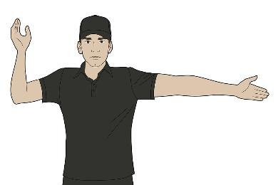

### 15.2 COMPLETION OF HALF / FULL TIME
Arms crossed in front of chest. Palms out.

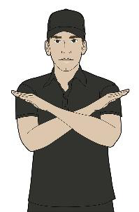

### 15.3 GOAL
Arms extended, palms together. Point to centre of field.

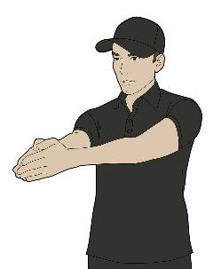

### 15.4. DISALLOWED GOAL
Repeated crossing of arms at thigh level.

Palms open.

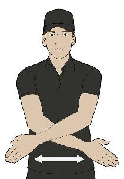

### 15.5 SIDELINE THROW / CORNER
Point at sideline.

Other arm showing direction of play.

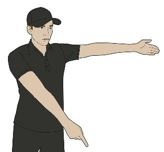

### 15.6 GOAL LINE THROW
Point open hand, arm extended along goal line. 

Other arm showing direction of play. 

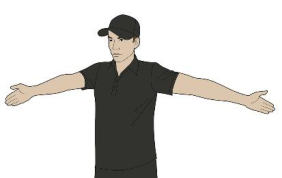

### 15.7 TIME OUT
Form "T" with hands above head. 

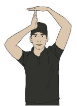

### 15.8 REFEREE'S BALL
Arms extended forward at shoulder level, fists clenched, thumbs up. 

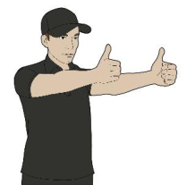

### 15.9 OBSTRUCTION
Hold one (1) arm up in the air fist clenched for the period of two (2) seconds, and then point at the position where the free shot has to be taken. 

Other arm showing direction of play. 

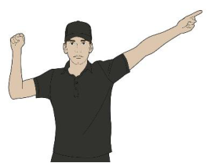

### 15.10 ILLEGAL KAYAK TACKLE
Hold clenched fist against hip for the period of two (2) seconds, and then point at the position where the free shot has to be taken. 

Other arm showing direction of play. 

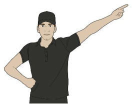

### 15.11 5 SECONDS / POSSESSION
Hold hand up at side at head level, palm forward. Spread all fingers for the period of two (2) seconds, and then point at the position where the free shot has to be taken. Other arm showing direction of play. 

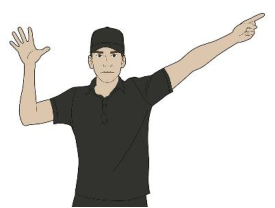

### 15.12 ILLEGAL USE OF PADDLE

The side of the other hand repeatedly chops the upper arm showing in direction of play for the period of two (2) seconds, and then point at the position where the free shot has to be taken. 

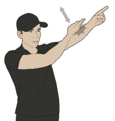

### 15.13 PLAY ON / ADVANTAGE

One arm elbow bent, rotating in a circular motion across the body at hip level continuously to a maximum of five (5) seconds. Other arm showing direction of play. 

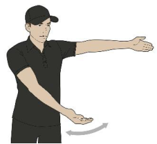

### 15.14 FREE THROW 

Arm extended, palm open, pointing in direction of play parallel to side of field. Other arm showing offence signal (1, 5, 6, 11 or 13). 

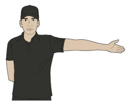

### 15.15 FREE SHOT 

Arm extended, index finger pointing at goal in direction of attack. Other arm showing offence signal (9, 10, 11 or 12). 

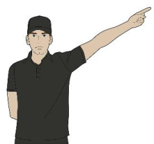

### 15.16 GOAL PENALTY SHOT
Both arms extended index fingers together and pointing at goal. 

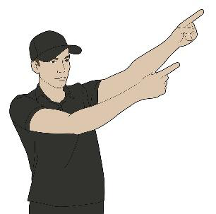

### 15.17 SHOWING CARDS
* Green card
* Yellow card 
* Red card 

Hold card above the shoulder so that is visible in front and behind. 

Other arm pointing to player. 

If necessary, indicate number of player with fingers. 

Use clenched fist to indicate ten where a number 10 or larger is required. 

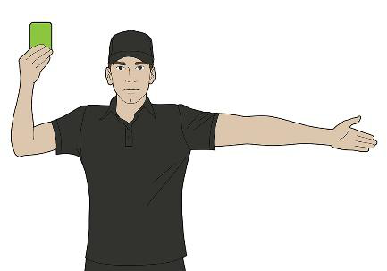

### 15.18 UNSPORTING BEHAVIOUR
One index finger on one (1) hand waved from side to side repeatedly 

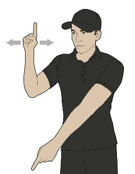

### 15.19 Illegal Holding / Illegal Hand Tackle
Hold one (1) arm up in the air, fist clenched and moving vertically for the period of two (2) seconds, and then point at the position where the free shot must be taken. 

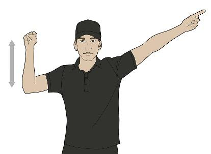

### 15.20 Ejection Red Card
Show the red card only, holding the card in one hand, crossed arms with clenched fist above the shoulder (so that it is visible in front and behind) and verbal statement “ejection red” to the player. 

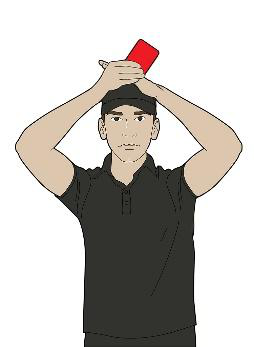

## **CHAPTER 16 - EQUIPMENT AND SCRUTINERRING** 

## **16.1 - ICF CANOE POLO KAYAK MANUFACTURERS SCHEME [SR]** 

16.1.1 - After 1[st] January  2015 - All new composite Canoe Polo kayaks manufactured by registered ICF Canoe Polo Kayak manufacturers must have an ICF Canoe Polo Manufacturers Label permanently fixed into the inside surface of the kayak in plain view in front of the seat that cannot be removed or tampered with in any way. These labels can only be purchased by manufacturers registered with the ICF Canoe Polo Manufacturers Scheme. 

16.1.2 - After 1[st] January 2015 - All Canoe Polo kayaks constructed by registered ICF Canoe Polo Kayak manufacturers must conform to all of these ICF Canoe Polo Kayaks Specifications. Any breaches of these specifications will result in the immediate suspension of that manufacturers license for a period of two (2) years. During this time, NO kayaks built by that manufacturer will be permitted in ICF Canoe Polo sanctioned competitions such as World Championships or World Games. 

16.1.3 - After 1[st] January 2015 - All Canoe Polo kayaks that are used in ICF sanctioned competitions including World Championships and World Games, that do not have a visible ICF Canoe Polo Kayak Manufacturers Label will be individually tested with the appropriate gauges to ensure they comply with these new specifications. Any kayaks that fail these tests will not pass scrutineering and will not be used in ICF Canoe Polo competitions. 

16.1.4 - After 1[st] January 2016 - All Canoe Polo Kayaks used in ICF sanctioned competitions including World Championships and World Games, must be constructed by manufacturers registered with the ICF Canoe Polo Kayak Manufacturers Scheme. There will be a list of Registered manufacturers in the Canoe Polo section of the ICF Website. 

16.1.5 - After 1[st] January 2021 - Only kayaks with an ICF Canoe Polo Kayaks Manufacturers Label will be able to be used at ICF World Championships or World Games. (This does not prevent the use of older kayaks without a label at a lower level within domestic competitions see note below.) 

16.1.6 - National Federations may have their own local rules regarding the use of older designs or kayaks including those without an ICF Canoe Polo Manufacturers label.  Please consult your National Federation for details. 

_Note: The ICF Canoe Polo Committee recognises the lifespan of a Canoe Polo kayak can be many years- even at the highest level. These rules effectively mean that any existing kayak built prior to 1[st] January 2015 that does not have an ICF Canoe Polo Manufacturers Label, will not be able to be used in the 2022 Canoe Polo World Championships._ 

16.1.7 - The ICF Canoe Polo Committee will maintain a list of approved Scrutineers experienced in the use of the ICF Gauges and the scrutineering rules. Manufacturers may contact these Scrutineers and request them to check a new kayak design or other item of equipment for compliance with the ICF Canoe Polo specifications. The manufacturer will be required to reimburse any relevant costs incurred by the Scrutineer such as travel, accommodation and meals to complete these checks. 

16.1.8 - Registered ICF Manufacturers will be required to maintain a complete list of all Canoe Polo kayaks they manufacture and the ICF Label number associated with each kayak. The ICF Canoe Polo Committee can request a copy of this list as part of auditing. 

16.1.9 - Any kayak that is modified (excludes normal repairs) by anyone other than the original manufacturer will have its ICF label cancelled or removed and will be scrutineered the same as any other kayak without an ICF Manufactures label.  Any manufacturer found to be modifying, changing or repairing a rival manufacturers design that risks the legality of that design will have their licence immediately suspended for a period of two (2) years. 

## **16.2 - KAYAK SAFETY REQUIRMENTS** 

## **[SR]** 

16.2.1 - All profiles and curves must stay within these rules and will be scrutineered with official ICF Canoe Polo gauges. 

16.2.2 - For all composite and plastic kayaks, all metal bolts, screws or other fixing devices should have low profile parts on the surface, be smooth to the touch and be recessed wherever possible. 

16.2.3 - Carry handles of any type are not permitted. 

16.2.4 - Concave sections are allowable throughout the kayak so long as they do not present themselves as a dangerous feature and comply with the minimum radius. 

16.2.5 - The kayak must have soft, shock absorbing material (padding) firmly affixed to the front and rear impact zones sufficient to prevent injury to players and to reduce damage to equipment. This padding must comply with the detailed specifications described in the article 16.6. 

16.2.6 - The kayak must have sufficient buoyancy to keep it afloat, so that some part breaks the surface of the water, even when it is completely full of water. 

16.2.7 - The weight, including padding, may not be less than 7kg. 

## **16.3 - KAYAK DIMENSIONS, MEASUREMENTS AND GAUGES** 

## **[SR]** 

16.3.1 - All measurements will be carried out on a completed kayak with padding in place. 

16.3.2 - Length 

16.3.2.a - A kayak with integrated padding attached Maximum 3000mm. 

16.3.2.b - A kayak with non-integrated padding attached Maximum 3100mm. (A kayak with non-integrated padding measured with no padding attached Maximum 3000mm). 

## 16.3.3 - **Width** Maximum 650mm 

16.3.4 - Kayak – Edge 

16.3.4.a - The edge is the line around the kayak (not necessarily the join or gunwale line) where the side or end meets the vertical tangent. References to the top, upper, lower or bottom of a kayak are relative to this edge. 

16.3.4.b - The edge of the kayak must be of sufficient radius so as not to cause injury to a player on impact. 

16.3.4.c - In profile the minimum radius of curvature for the edge in each section is detailed in the following sections. 

16.3.5 - Kayak – Shape in Plan 

16.3.5.a - In plan the minimum radius of convex curvature for the edge is 100mm throughout the edge of the kayak. Gauge 1, detail G 

16.3.5.b - In both, the front and rear impact zones, a minimum width of 200mm must be reached within the first 100 mm of the kayak. 

16.3.5.c - For kayaks with integrated padding the first 100mm is measured with padding in place. Gauge 1, detail H 

16.3.5.d - For kayaks with non-integrated padding the first 100mm is measured from the back edge of the padding where it attaches to the kayak. Gauge 1, detail I. 

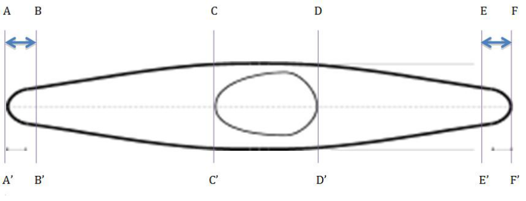

_Figure 1 - KAYAK PLAN VIEW OF SECTIONS/ZONES_ 

- Section AA' to BB' - Front Impact Zone - measured to the point 100mm down the length of the kayak 100 mm minimum radius at any point on B-A-B' 

- Section BB’ to CC’ - Front Section - 

- Section CC’ to DD’ - Cockpit Section - 

- Section DD’ to EE’ - Rear Section - 

- Section EE’ to FF’ - Rear Impact Zone – measured to the point 100mm up the length of the kayak 100mm minimum radius at any point on E-F-E' 

## 16.3.6 - Kayak – Top and Bottom surface 

16.3.6.a - The top and bottom surfaces (excluding those parts of the cockpit covered by a spray deck) must be smooth so as not to cause injury to a player. 

16.3.6.b - Section AA' to BB’ - Front Impact zone: The kayak (with nonintegrated padding) will meet a minimum thickness of 55mm with 30mm of the edge of the kayak. If the kayak has non-integrated padding attached, the 30mm will be measured from the rear of the padding where it attaches to the kayak. The minimum radius of convex curvature allowed above the edge of the front impact zone is 20mm. Gauge 2, detail K and L. 

16.3.6.c - If a kayak has integrated padding - the padding must comply with separate minimum specifications for the Front Impact Zone AA’-BB’ see article 16.6.3 Integrated Padding 

16.3.6.d - Section BB’ to FF’ - For the entire edge the kayak will meet a minimum thickness of 50mm with 30mm of the edge of the kayak. Gauge 3, detail M 

16.3.6.e - Section AA' to FF' - For the entire bottom surface of the kayak below the edge, and across the edge itself the minimum radius of convex curvature allowed is 20mm. Gauge 2, 3 or 5, detail L 

16.3.6.f - Section BB’ to FF’ - For the entire top surface of the kayak in profile above the edge once the minimum thickness has been reached, the minimum radius of convex curvature allowed is 5mm. Gauge 7, detail T 

16.3.6.g - Recesses in the hull or deck for the purpose of hiding bolt or screw heads etc. are to be permitted. Recesses should be safer than a projecting fixing device in order to be legal. Where recesses are provided to improve safety by eliminating projecting fixing devices, the 5mm radius can be relaxed as far as it would cover the radius of any transition curve between the deck and the side surfaces of any such recess. 

## 16.3.7 - Kayak – Depth 

16.3.7.a - The depth at the cockpit must be sufficient to provide some protection from impact for the player. 

16.3.7.b - Throughout the length of the cockpit section of the kayak (from CC' to DD'), on each side of the cockpit, the kayak must be a minimum of 140 mm deep, as seen in profile, not including the cockpit edge (rim). 

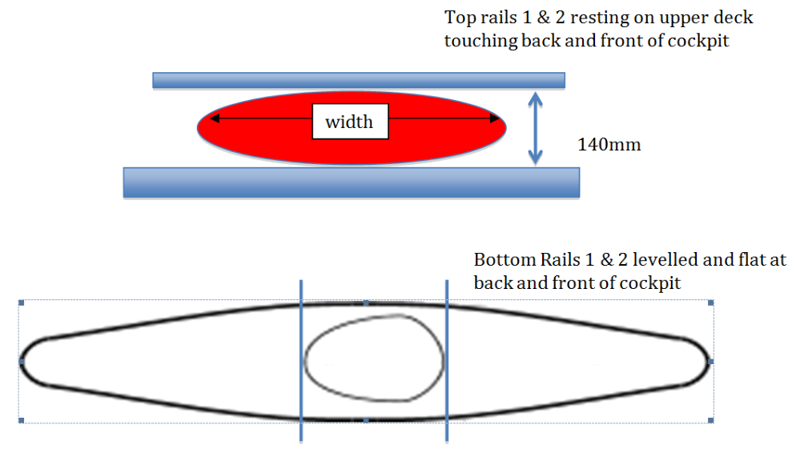

_Figure 2_ 

## **16.4 - KAYAK GAUGES – REQUIREMENTS** 

**[SR]** 

16.4.1 - Only official ICF Canoe Polo gauges are to be used to test compliance with these specifications. 

16.4.2 - The gauges will be fabricated from sheet aluminium or stainless steel and precisely engineered, according ISO 2769-mH, by an approved ICF supplier and will be stamped with the ICF Logo, registration number and date of manufacture. 

**[SR]** 

## **16.5 - KAYAK GAUGES - DEFINITION** 

## 16.5.1 - Gauge 1 

- Impact Zone AA’ to BB” and EE’ to FF’ 

- Impact zone gauge, 100 mm radius, must be used to measure in plan sections AA’ to BB’ (front) and EE’ to FF’ (back). The kayak with padding in place must meet a minimum width in plan of 200mm within 100mm of the end of the kayak. 

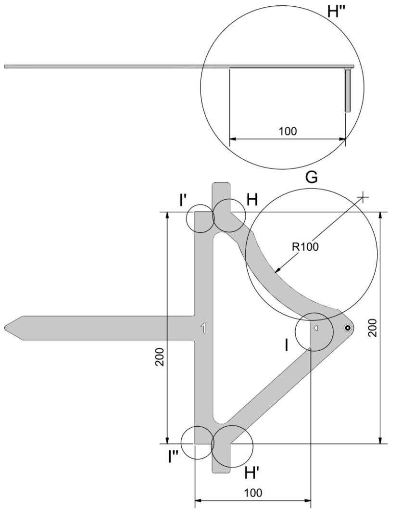

_Figure 3- Gauge 1_ 

## 16.5.2 - Gauge 2 

- Front Impact Thickness Zone AA’ to BB’ (not used on integrated padding) 

- Impact Zone thickness - 55mm thickness at 30mm depth, must be used levelled to measure the edge thickness of the kayak. 

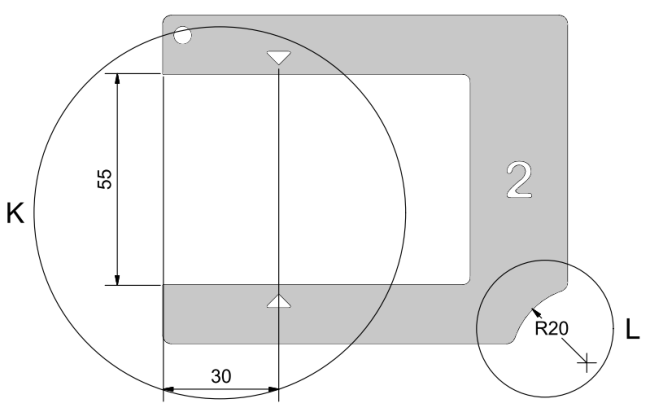

_Figure 4 - Gauge 2_ 

## 16.5.3 - Gauge 3 

- Edge Thickness Zone BB’ to CC’ and DD’ to FF’ (includes rear integrated padding) 

- Edge Thickness gauge, 50mm thickness at 30mm depth, must be used levelled to measure the edge thickness of the kayak. 

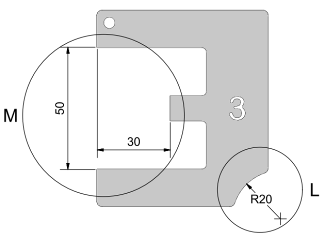

_Figure 5- Gauge 3_ 

## 16.5.4 - Gauge 2, 3 or 5 – detail L 

- Radius for whole bottom surface and across the edge AA’ to FF’ 

- Gauge 2, 3 or 5, detail L, 20mm radius, used to measure the whole surface of the kayak below the edge, and the edge itself. To gauge the radius of curvature, the radius portion of the appropriate gauge, must be applied perpendicular to the surface being tested. If both points X and X’ (see below) touch the surface at the same time without the rest of the kayak the test is passed. 

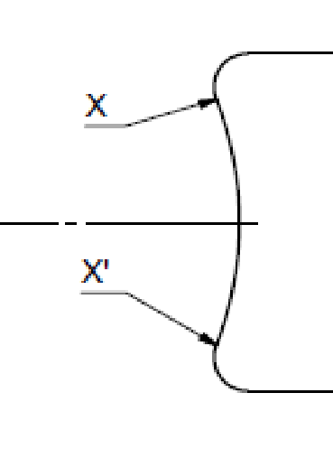

_Figure 6 - Detail L_ 

## 16.5.5 - Gauge 7 

- Radius for whole upper surface zone BB’ to FF’ 

- Gauge 7, detail T, 5mm radius, used to measure the whole surface of the kayak above the edge once a thickness of 50mm (Gauge 3, detail M) has been reached except the cockpit area CC’ to DD’. 

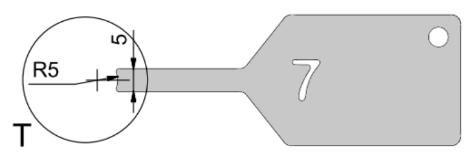

_Figure 7 - Gauge 7_ 

## **16.6 - PADDING** 

## **[SR]** 

## 16.6.1 - Padding Material 

16.6.1.a - The padding must be made from a soft, shock absorbing homogeneous material (e.g.: foam, soft rubber). If it relies on a composite construction for its minimum thickness and shock absorbing property, then the essential shock absorbing property of the padding must not be lost under compression. The characteristics should be measured at the temperatures that will prevail during the competition. 

16.6.1.b - The padding must be a minimum of 30mm thick (when uncompressed) – more is recommended to allow for shrinkage and compression over time. 

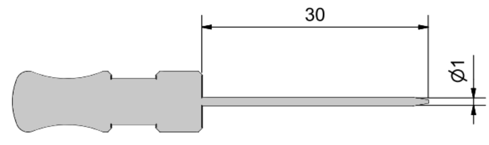

_Figure 8 - Gauge 4 – needle_ 

16.6.1.c - The 30mm thickness must be reached on the horizontal centreline of the padding in profile. It may be reduced to not less than 20mm thickness at a width of 25mm either side of the edge in profile. 

16.6.1.d - The padding must be compressible (by a Scrutineer’s or player’s thumb) by at least 10mm. The padding must not be compressible to less than 10mm thickness. The thickness and compression are measured horizontal and vertical to the surface of the padding in plan. 

16.6.1.e - The padding must be firmly attached to cover the edges of the front and rear impact zones at the horizontal centreline. 

16.6.1.f - The padding must extend at least 100mm from each end of the kayak measured in plan. Gauge 1, detail H or I 

## 16.6.2 - Attachment 

16.6.2.a - The padding must be attached firmly to the end of the kayak to ensure there is no possibility of the padding either falling off or moving out of position during the course of a competition. 

16.6.2.b - The padding must be attached in a way that the edges and ends are not liable to catch on players or equipment. 

16.6.2.c - If rivets or bolts (or similar) are used to attach the padding, they must be recessed at least 20mm into the padding from the outer most part. 

## 16.6.3 - Integrated Padding 

16.6.3.a - For a kayak with integrated padding, the padding must comply with the following minimum specifications: 

(i) For the Front impact zone, the padding must be a minimum 60mm high in profile and extend at least 100mm from the ends measured in plan. Gauge 5, detail N; Gauge 1, detail H 

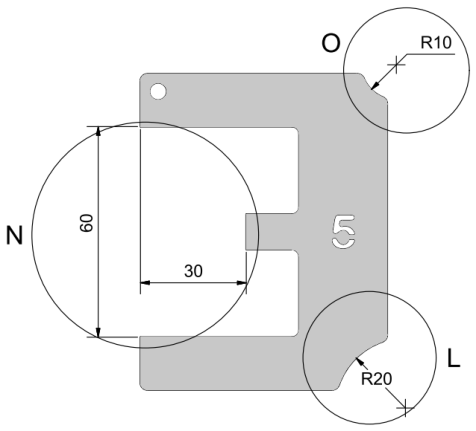

_Figure 9 - Gauge 5 Front Impact Zone (Integrated Padding only) AA’ to BB’_ 

(ii) The Front Impact zone padding must be a minimum radius of at least 10mm over the whole surface of the padding. Gauge 5, detail O 

(iii) For the Rear impact zone, the padding must be a minimum 50mm high in profile and extend at least 100mm from the ends measured in plan. Gauge 3, detail M; Gauge 1, detail H 

(iv) The rear impact zone padding must be a minimum radius of at least 5mm over the whole surface of the padding. Gauge 7, detail T 

16.6.3.b - The shape of the kayak beneath the integrated padding is not important while the padding is in place as long as the whole kayak meets the specifications outlined in the articles 16.1 to 16.3. 

16.6.3.c - In general, the padding profile must follow the profile of the kayak ends and the integrated padding must be appropriate for that design of kayak. 

16.6.3.d - For a kayak with integrated padding there should be no (minimal<5mm) gap between the start/edge of the padding and where it joins the kayaks. Any part of the kayak that meets the padding must have a minimum of 5mm radii. This 5mm gap can be measured with Gauge 7 

16.6.4 - Non-Integrated Padding 

16.6.4.a - Kayaks with non-integrated padding must comply with the kayak specifications in in the articles 16.1 to 16.3 if the padding is removed. 

16.6.4.b - The padding must comply with the padding specifications described above in the articles 16.6.1 and 16.6.2. 

16.6.4.c - For kayaks with non-integrated padding - the padding must be positioned on the edge (see definition of edge in kayak specifications) to cover at least 15mm above and below the edge. 

16.6.4.d - The non-integrated padding must comply with the minimum dimensions below 

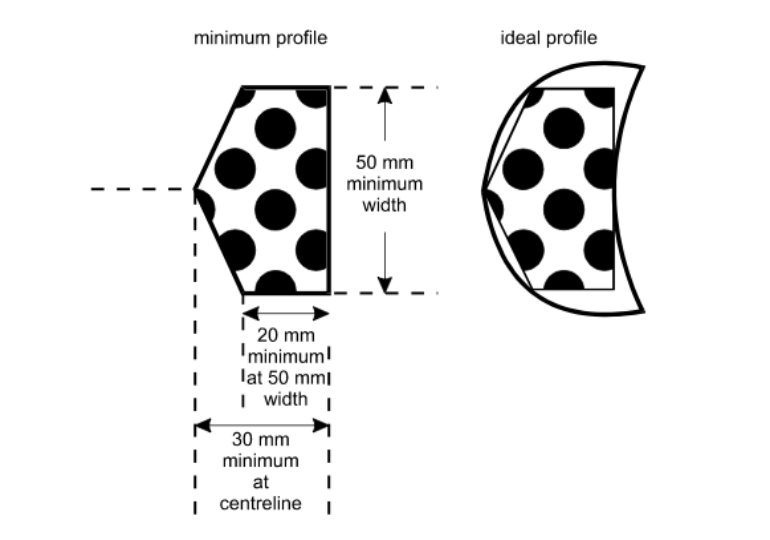

_Figure 10 - To define_ 

## **16.7 - PADDLE** 

## **[SR]** 

16.7.1 - The paddle must be double bladed with no sharp projections, edges, holes or other dangerous features. The blades shape, thickness and radii must stay within these rules. The paddle will be scrutineered with a gauge. 

16.7.2 - The blades are to be no more than 600mm x 250mm in plan measured from where the shaft meets the blade. The edges must have a minimum radius of 30mm in plan and a minimum thickness of 5mm. Metal tipped blades are not allowed. 

16.7.3 - The exception to this is those blades where the metal edge is an integral part of the construction as opposed to a rim or trim added to the outside by any means. However, if at any point the internal metal component is exposed then it will be considered un-fit for use in Canoe Polo. 

## **16.8 - PADDLE GAUGE** 

## **[SR]** 

16.8.1 - Only official ICF Canoe Polo gauges are to be used to test compliance with these specifications. The gauges will be fabricated from sheet aluminium or stainless steel and precisely engineered, according ISO 2769-mH, by an approved ICF supplier and will be stamped with the ICF Logo, registration number and date of manufacture. 

16.8.2 - To gauge the radius of curvature the radius portion of gauge 6, detail R, must be applied perpendicular to the surface being tested. If both points X and X’ touch the surface at the same time without the rest of the paddle the radius test is passed. 

16.8.3 - To gauge the thickness of the paddle-blade, hold the slot of gauge 6, detail Q, over the blade. If the paddle does not enter the slot, the test is passed. 

## **16.9 - HELMET AND FACEMASK** 

## **[SR]** 

16.9.1 - The helmet must be suitable for canoeing and have a Facemask attached. 

16.9.2 - In the interest of player welfare, it is recommended that all helmets be suitably accredited with an International Standard for canoeing. 

16.9.3 - The Helmet must protect the players head from the temples to the base of the skull to ensure that no contact is possible between the skull and a blade of a horizontally held paddle (Note there is no requirement to cover the ears). 

16.9.4 - The Helmet must be correctly fitted to the individual to ensure maximum protection against any blow which may be reasonably anticipated in the course of a game. 

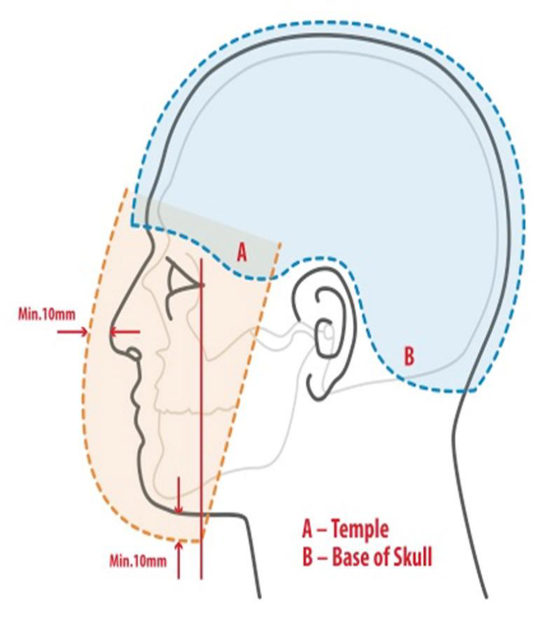

16.9.5 - The helmet and facemask must protect the entire face beginning at the lower level of the chin, and jawline and covering the surface between the two (2) temples to ensure that no contact is possible between the face and a blade of a horizontally held paddle. 

16.9.6 - There must be a minimum distance of 10mm between the facemask and the nose of the wearer. 

16.9.7 - The facemask must be of a strong material such as steel or other equally strong material. 

16.9.8 - The facemask must be securely fixed to the helmet, without any sharp edges or dangerous fixings. 

16.9.9 - The facemask must have no horizontal or vertical opening any larger than 70mm. 

16.9.10 - This will be measured by gauge 6, detail S. 

16.9.11 - The gauge 6, detail S, may not enter in an opening in the horizontal or vertical plane including the edge where the facemask joins the helmet. 

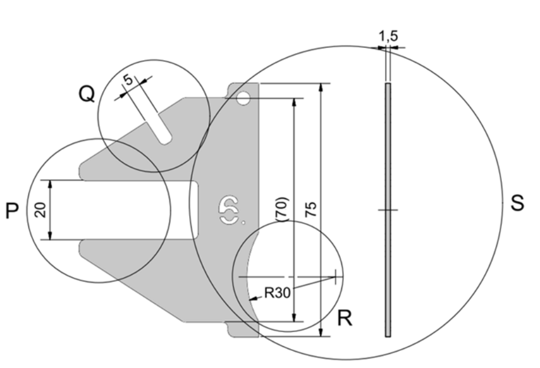

_Figure 11 - Gauge 6 – paddle, facemask and body protection_ 

## **16.10 - BODY PROTECTION** 

## **[SR]** 

16.10.1 - The body protection in the form of a Personal Floatation Device (PFD) must meet or exceed the current ISO 12402-5:2020 and carry the appropriate label. 

16.10.2 - The body protection must be at least 20mm thick. 

16.10.3 - To gauge the thickness of the body protection, hold the slot of gauge 6, detail P, over the body protection. If the body protection does not enter the slot, the test is passed. 

16.10.4 - The body protection must protect against any impact from other players equipment, which may be reasonably anticipated in the course of a game. 

16.10.5 - The body protection must begin no more than 100mm above the cockpit rim measured at the player’s side, with the player sitting normally in their kayak. 

16.10.6 - The gap between the top of the protection at the side and the top of the armpit measured with the arm horizontal must be less than 100mm. (These measurements may be checked at any stage during the game by either Referee) 

**16.11 - SCRUTINEERING – MAJOR COMPETITIONS [SR]** 

16.11.1 - For major competitions including World Championships and World Games, scrutineering of equipment will be a 3–step process. 

16.11.2 - At the commencement of scrutineering, each team will present their equipment for checking. 

16.11.3 - Each player will initially be present wearing his or her Helmet (with facemask). These will be checked for compliance with the article 16.9. Any safety issues must be rectified immediately before the team can progress further. All equipment will then be placed at Stage 1 and all players will then leave the scrutineering area. 

16.11.4 - Only one (1) team representative may remain to oversee the scrutineering process for each team. 

16.11.5 - Each kayak will have a scrutineering check sheet attached to the seat. This sheet will remain with the kayak throughout scrutineering. Each team will also have a team sheet for all paddles, helmets, and body protection. The template for the scrutineering kayak check sheet and the scrutineering team check sheet is available on the ICF website in the rules section (www.canoeicf.com). 

16.11.6 - Any issues identified on any piece of equipment will be clearly noted on its check sheet and initialled by the Scrutineer. This issue must be rectified prior to the equipment moving onto the next stage. 

16.11.7 - Step 1 – Cosmetic Checks 

16.11.7.a - This step will ensure all items of equipment are uniform in colour and decals for each team. 

16.11.7.b - Kayak checks will ensure any vinyl covering is of a high quality, with limited wrinkles and creases and will last the duration of the competition. If vinyl covering is used it must uniform in colour and texture for the whole team. 

16.11.7.c - Kayaks must be uniform in colour and logos above the edge (for World Games they must also be uniform below the edge). Clear finish must be uniform in terms of weave. Clear finish with Carbon weave is NOT considered to be the same as a solid black colour due to the different weaves and appearances. 

16.11.7.d - Helmets must be of a uniform solid base colour- the practice of covering a helmet with strips or sections of vinyl or tape is no longer acceptable. 

16.11.7.e - Helmet numbers must be the minimum size of 75mm high and be a clearly contrasting colour and font size to stand out from a distance. Helmet numbers must be cut from one (1) piece of vinyl- strips of tape or vinyl to create numbers is no longer acceptable. 

16.11.7.f - Apart from the numbers, all stickers and logos must be identical in size, colour and location. Previous competitions scrutineering stickers must be removed. 

16.11.7.g - Body protection must be uniform in colour and appearance. Player numbers must be the minimum size on both sides. Front 100mm and back 200mm. 

16.11.7.h - Any equipment failing the cosmetic test will result in the whole team failing. The whole team will lose their scrutineering time slot and will return for rechecking at a later time. Rechecking will take place after all other teams have had their initial checks. Practice times will not be rescheduled. 

16.11.7.i - Each failed item will be subject to a 50€ fine. This fine must be paid before rechecking will occur before progressing to Step 2. 

16.11.8 - Step 2 - Safety Checks 

16.11.8.a - This step will check all equipment for points of safety. 

16.11.8.b - Kayaks will be tested for sharp edges, rough surfaces and padding attachment. 

16.11.8.c - **Kayak padding must be in new or near new condition** and in one (1) homogenous piece firmly attached to the kayak with no lose edges or ends as per the specifications. No tape, wrapping, extra foam or other substances may be used to increase the padding profile or to ensure correct attachment! 

16.11.8.d - Any padding failing Step 2 must be replaced with a new padding of the appropriate type to suit the kayak design before it will pass. It is recommended that teams or individuals carry spare sets of padding for each design. (Minor repairs can be completed during the competition with tape or wrapping) 

16.11.8.e - Paddles must have no sharp edges or lose tape. Edge thickness will be tested using the appropriate gauge. Edging materials such as Kevlar tape must be correctly attached with no loose edges. 

16.11.8.f - Helmets must have a correctly fitting facemask that covers from the jawline to the temple that complies with the regulations (See specification in the article 16.9). 

16.11.8.g - Body protection in the form of a PFD must have the required thickness of 20mm on the front, back and sides (See specification in the article 16.10). 

_(Please note- this is a NEW specification to improve player safety. PFD’s that previously passed scrutineering may not meet this increased specification.)_ 

## 16.11.9 - Step 3 - Technical Checks 

16.11.9.a - This step will check the technical aspects of all equipment in particular the kayaks. 

## 16.11.9.b - Kayaks will be checked for the following: 

(i) ICF Canoe Polo Kayak Manufacturing Label fixed inside kayak. Any kayak built after 1[st] January 2015 must have an ICF label permanently fixed on the inside surface in front of the seat. These kayaks will receive the following checks: 

- Random gauge checks of all main dimensions- Length, Width, Depth and Weight 

- Random gauge checks of all main radii and/or height/depth/width 

(ii) Any kayak built prior to 1[st] January 2015 that does not have an ICF Label will be subject to ALL of the standard gauges for length, width, depth, weight and radii. Note: After 1[st] January 2019, all kayaks must have an ICF Label to be used in ICF competitions including World Championships and World Games. (This does not prevent these kayaks being used in other competitions around the world.) 

16.11.9.c - Any kayak failing any technical specifications will fail scrutineering and will not be able to be used in the competition. 

## 16.11.10 - Procedure 

Stage 1 - Players are pre-checked wearing helmet for safety checks. 

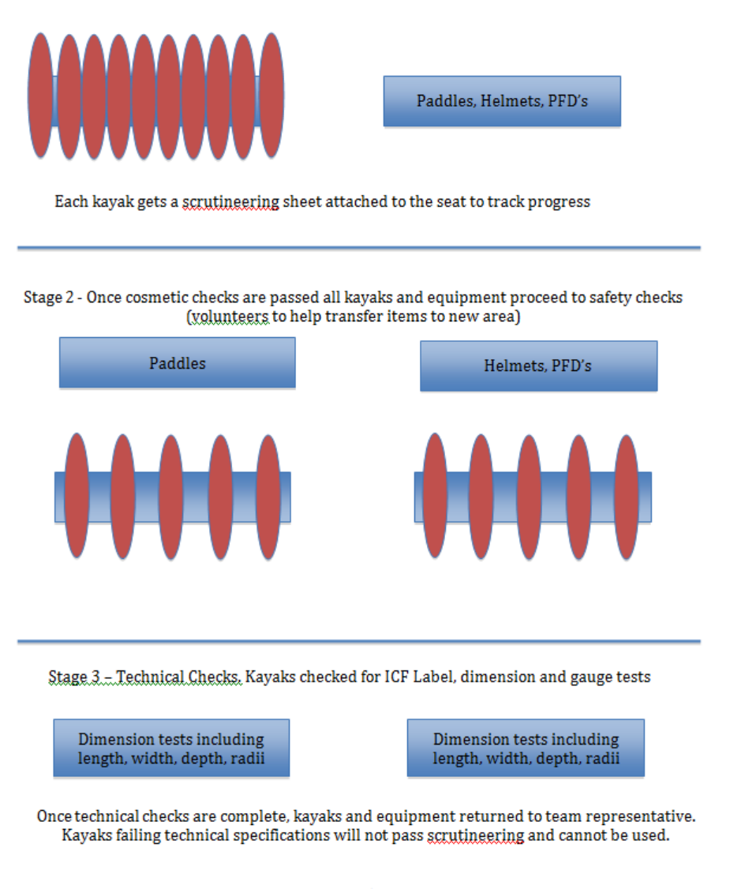

## **CHAPTER 17 - SHOT CLOCK** 

**The shot clock rules will be used in any World Games, World Championships and are recommended for use in Continental Championships.** 

**The shot clock rules may also be used for any other competition provided all teams are clearly notified it will be used.** 

## **17.1 - DEFINITION** 

**[SR]** 

17.1.1 - To be considered a shot at goal, the shot must clearly be an attempt at goal which either: 

- Enters the goal. 

- Is blocked by a goalkeepers or defenders paddle. 

- Rebounds off the goal frame. 

- Misses the goal and goes out of play within the four (4) metres either side of the goal. 

17.1.2 - A team must attempt a shot at goal within 60 seconds of gaining possession or control of the ball. 

17.1.2.a - After 1[st] January 2027 – A team must attempt a shot at goal within 60 seconds of gaining possession or control of the ball. If a team, after a shot, retains possession any subsequent shot/s must be made within 30 second periods. 

17.1.3 - Failure to do so will result in possession of the ball and a free shot being awarded to the other team. 

17.1.4 - The free shot is to be taken where the ball is at the time of the shot clock expiring. 

17.1.5 - If the ball is out of play at the time the shot clock expires - the free shot will be taken from the closest point to where the ball went out of play. Signals 11 and 15 applies. 

## **17.2 - OPERATION** 

## **[SR]** 

17.2.1 - The shot clock will be operated by the timekeeper. 

17.2.2 - The shot clock will be directly linked to the main game clock and will stop whenever the main game clock stops either after a goal or when either Referee calls time out, or when the ball is out of play. 

17.2.3 - The shot clock will restart when the Referee restarts play with a whistle or when the player taking the throw holds the ball up to take the throw. 

17.2.4 - The shot clock must be able to be stopped independently of the main game clock. 

17.2.5 - In the last minute of each half the shot clock must show the same as the main game clock with time remaining in the half. 

## **17.3 - VISIBLITY AND SOUND SYSTEM** 

## **[SR]** 

17.3.1 - Two (2) shot clocks will be clearly visible to all players and spectators. 

17.3.2 - They must be positioned on the field either directly above, directly below, or to the side of each goal, or in the corners of the field, on the same side as the controlling Referee. 

17.3.3 - The shot clock will have an audible signal device of a distinctive tone that can be clearly heard by all players and officials involved in a game. 

17.3.4 - The tone of the shot clock signal must be different to the main timekeepers signal. 

17.3.5 - The shot clock signal will sound at the completion of 60 seconds indicating that the shot clock time has expired. 

17.3.5.a - After 1[st] January 2027 – The shot clock signal will sound at the completion of 60/30 seconds indicating that the shot clock time has expired. 

17.3.6 - The Referees will confirm the change of possession with a single blast of the whistle and award a free shot to the opposition. 

## **17.4 - SHOT CLOCK EXPIRY** 

## **[SR]** 

17.4.1 - For a goal to be scored, the shot at goal must have been taken prior to the start of the shot clock expiry signal. 

17.4.2 - If the ball is in flight at the time of the signal it will be allowed to travel to completion. 

17.4.3 - The ball must have left the players hand prior to the signal sounding. 

## **17.5 - SHOT CLOCK RESET** 

**[SR]** 

17.5.1 - The shot clock will be reset whenever there is a shot at goal or a change in team possession. 

17.5.2 - If a team attempts a shot and the ball rebounds off the goal frame, a defenders or goalkeepers paddle, out of bounds or back into play, the shot clock will be reset even if the same team that took the shot regains possession of the ball. 

17.5.3 - If a team attempts a shot that falls short of the goal and remains in play the shot clock will not be reset if the same team that took the shot regains possession of the ball. 

17.5.4 - If a team that is not attempting a shot at goal loses control of the ball out of bounds and regain possession as a result of a sideline throw or corner throw, the shot clock will not be reset. 

17.5.5 - If two (2) players of opposing teams momentarily share possession or control of the ball, the shot clock will only be reset if there is a clear change of possession of the ball to the other team. 

17.5.6 - If a team momentarily (very short period of time) loses control or possession of the ball and that team regains control or possession the shot clock will not be reset. 

17.5.7 - The shot clock will be reset if a team receives a free shot or if the Referee plays advantage as a result of a foul by the opposing team. 

## **CHAPTER 18 - ICF CANOE POLO WORLD RANKING** 

**18.1 - PRINCIPLES [SR]** 

18.1.1 - The objective of ICF Canoe Polo World Ranking is to establish a ranking system for National Federation teams in Canoe Polo. 

18.1.2 - The ICF World Ranking is an ongoing system of points rank all teams in each event. 

18.1.3 - World Ranking points will be given at World Championships and at each Continental Championships. 

18.1.4 - The ICF World Ranking is taken from the most recent World Championships and the most recent Continental Championships results. 

**18.2 - RESULTS AND RANKING MANAGEMENT** 

**[SR]** 

18.2.1 - The rankings will be produced by the ICF. 

18.2.2 - The updated rankings will be published after each competition. 

**18.3 - POINTS SYSTEM [SR]** 

The point system is defined in an appendix published by the ICF. 

## **CHAPTER 19 - APPENDICES** 

## **19.1 - LIST OF APPENDICES** 

## **[SR]** 

The ICF Canoe Polo Competition rules Book is linked to the following appendices: 

- Appendix 1: World Games – Qualification system 

- Appendix 2: World Championships – Qualification system 

- Appendix 3: ICF Canoe Polo World Ranking – point system 

- Appendix 4: ICF Canoe Polo referee code of conduct 

- Appendix 5: ICF Canoe Polo Commentator Code of Conduct 

- Appendix 6: Under 15 age group development recommendations 

## **19.2 - VALIDATION** 

**[SR]** 

The Canoe Polo Committee propose and publish the appendices after approval by the ICF Board of Directors. 

## **19.3 - PUBLICATION** 

**[SR]** 

The appendices are published on the ICF website in the rules section (www.canoeicf.com). 

